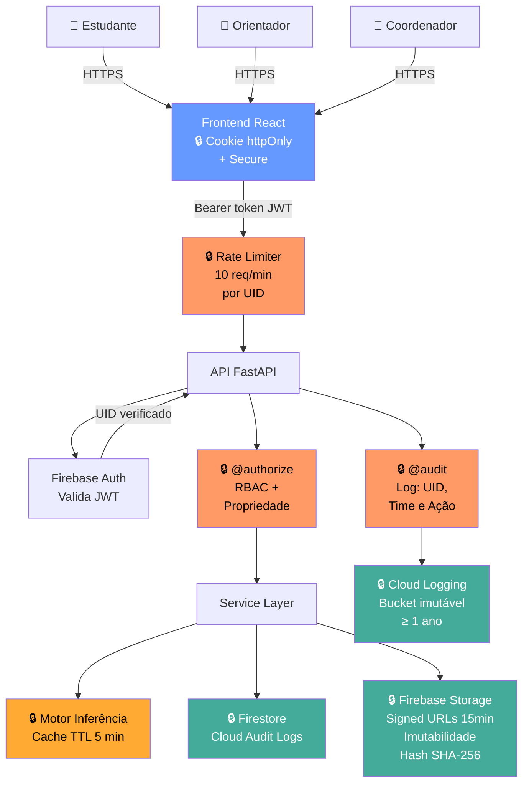

# Seção 13 — Diagrama da Arquitetura Segura e Decisões de Arquitetura

> **Arquivo de trabalho individual:** este arquivo corresponde à Seção 13 do documento principal [`docs/modelagem-de-ameacas.md`](../../modelagem-de-ameacas.md).

---

## 13. Diagrama da Arquitetura Segura e Decisões de Arquitetura

---

### 13.1 Diagrama da arquitetura segura

O diagrama abaixo representa a arquitetura do **ThesisFlow** com os controles de segurança prioritários posicionados. Os componentes em destaque (🔒) indicam salvaguardas adicionadas ou reforçadas em relação à arquitetura original.

*Figura: Arquitetura segura do ThesisFlow com controles de segurança posicionados. Componentes em vermelho são salvaguardas de controle de acesso; em verde, componentes com proteção de dados reforçada; em amarelo, componente com mitigação de disponibilidade.*

> **Nota:** A imagem deste diagrama está disponível em [`diagramas/etapa-3/`](../../../diagramas/etapa-3/).

---

### 13.2 Decisões de arquitetura (DA01–DA03)

As três decisões abaixo foram derivadas diretamente dos requisitos RS01–RS03 e dos riscos tratados com maior prioridade na Etapa 2.

| ID | Decisão tomada | Risco tratado | Justificativa | Componente afetado | Resultado esperado |
| :---: | :--- | :---: | :--- | :--- | :--- |
| `DA01` | Implementar verificação de propriedade do recurso no servidor em todos os endpoints que retornam dados de estudante, antes de qualquer acesso ao repositório | `R07` | Ocultar dados na interface ou filtrar resultados no frontend não impede o acesso direto à API; a verificação deve ocorrer no servidor, onde o atacante não tem controle | API FastAPI — todos os endpoints `GET /students/{student_id}/...` e equivalentes | Requisições com `student_id` diferente do UID autenticado são recusadas com HTTP 403 e registradas no `@audit`, eliminando o IDOR |
| `DA02` | Substituir URLs públicas de download do Firebase Storage por Signed URLs geradas on-demand via endpoint autenticado do backend, com validade de 15 minutos | `R08` | URLs públicas ficam acessíveis indefinidamente após qualquer vazamento — por e-mail, screenshot ou descoberta por varredura. Signed URLs expiram e exigem autenticação no backend para renovação | Firebase Storage + endpoint de geração de URL no backend FastAPI | Comprovantes só podem ser acessados por usuários autenticados com o papel correto, durante a janela de 15 minutos; a URL expirada retorna HTTP 403 do Storage |
| `DA03` | Implementar rate limiting por UID autenticado nos endpoints que invocam o motor de inferência lógica, com cache de resultados por TTL de 5 minutos | `R09` | O motor de inferência realiza operações computacionalmente intensas a cada invocação; sem limitação, qualquer usuário autenticado pode degradar o sistema com um script simples. O cache reduz a carga real sem impactar a experiência de uso legítimo | API FastAPI — middleware de rate limiting (`slowapi`) + cache in-memory ou Redis nos endpoints `/students/{id}/status` e equivalentes | Cada UID fica limitado a 10 requisições por minuto nos endpoints do motor; o 11º retorna HTTP 429; resultados recentes são servidos do cache sem invocar o motor |

---

#### DA01 — Verificação de propriedade do recurso

**Problema:** A API do ThesisFlow retorna recursos de estudante com base no identificador da URL, sem verificar se o recurso pertence ao usuário autenticado. Qualquer estudante autenticado pode alterar o `student_id` em uma requisição e acessar dados de outro estudante (IDOR — Insecure Direct Object Reference).

**Decisão:** Em todos os endpoints que recebem um `student_id` como parâmetro, verificar no servidor — antes de qualquer consulta ao repositório — se o recurso pertence ao usuário autenticado. Estudantes só acessam seus próprios dados; orientadores acessam apenas dados de seus orientandos; coordenadores têm acesso irrestrito por papel.

**Motivo:** A verificação no frontend ou a filtragem de campos na resposta não resolve o problema — o atacante não usa o frontend. A única defesa efetiva é no servidor.

**Componente afetado:** Todos os endpoints `GET`, `PUT` e `DELETE` de recursos de estudante na API FastAPI.

**Resultado esperado:** Eliminação do vetor IDOR; HTTP 403 retornado para qualquer acesso cruzado, com registro no `@audit`.

---

#### DA02 — Signed URLs para download de comprovantes

**Problema:** URLs de download do Firebase Storage sem autenticação ficam acessíveis indefinidamente. Um link compartilhado por e-mail, capturado em um screenshot ou descoberto por varredura expõe documentos sensíveis sem nenhum controle.

**Decisão:** Nenhuma URL de Storage é exposta diretamente ao frontend. O frontend solicita o download de um comprovante via endpoint autenticado do backend, que gera uma Signed URL com validade de 15 minutos via Firebase Admin SDK e a retorna ao usuário. A URL é de uso único por janela de tempo.

**Motivo:** Signed URLs já são suportadas pelo Firebase Admin SDK sem necessidade de reestruturação do Storage. A validade curta limita o impacto de qualquer vazamento acidental.

**Componente afetado:** Firebase Storage (regras de leitura pública removidas) + novo endpoint `GET /comprovantes/{id}/download-url` no backend.

**Resultado esperado:** Comprovantes inacessíveis sem autenticação; URLs expiradas retornam HTTP 403; auditoria de cada acesso registrada.

---

#### DA03 — Rate limiting e cache do motor de inferência

**Problema:** O motor de inferência lógica realiza operações de satisfatibilidade sobre cláusulas Horn a cada invocação, com custo computacional proporcional à complexidade do estado acadêmico do estudante. Qualquer usuário autenticado pode invocar o motor repetidamente com um script simples, degradando o sistema para todos os outros usuários.

**Decisão:** Implementar rate limiting por UID autenticado com a biblioteca `slowapi` (integrada ao FastAPI) nos endpoints que invocam o motor. Adicionalmente, cachear os resultados do motor com TTL de 5 minutos: se o status acadêmico de um estudante foi calculado nos últimos 5 minutos, o cache é retornado sem nova invocação.

**Motivo:** O cache reduz a carga real sem impactar a experiência de uso legítimo — o status acadêmico raramente muda a cada minuto. O rate limiting garante que um único usuário não possa monopolizar os recursos do servidor.

**Componente afetado:** API FastAPI — middleware `slowapi` + cache in-memory (ou Redis em produção) no serviço de inferência.

**Resultado esperado:** Cada UID limitado a 10 req/min; o 11º retorna HTTP 429; o cache reduz invocações reais do motor em condições normais de uso.
