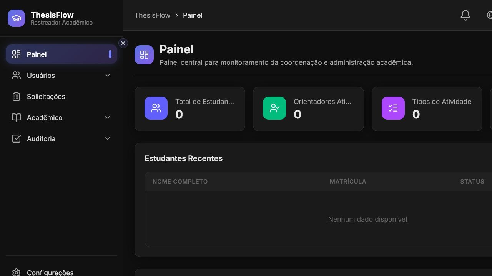
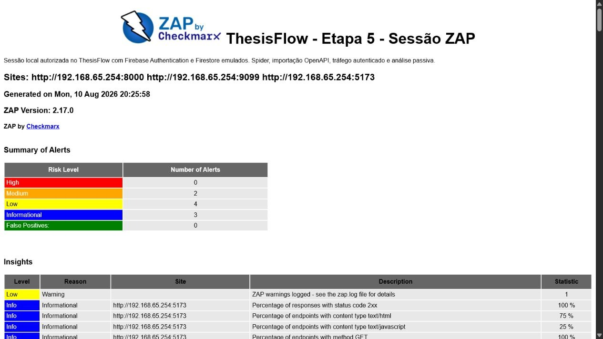

# Seção 15 — Verificação de Vulnerabilidades

> **Arquivo de trabalho individual:** este arquivo corresponde à Seção 15 do documento principal [`docs/modelagem-de-ameacas.md`](../../modelagem-de-ameacas.md).

---

## 15. Verificação de Vulnerabilidades

Esta seção apresenta uma sessão autorizada de verificação no **ThesisFlow**, sistema desenvolvido pelo próprio grupo. O **OWASP ZAP 2.17.0** acompanhou uma navegação autenticada, importou o contrato OpenAPI, executou spider tradicional e concluiu a análise passiva. Não foi realizado Active Scan nem exploração completa.

### 15.1 Ambiente e configuração

| Item | Configuração |
| :--- | :--- |
| Sistema | ThesisFlow, commit `486219c46ffce643e567a76b737e1f7b4cfc9964` |
| Frontend | React/Vite em `http://127.0.0.1:5173` |
| Backend | FastAPI em `http://127.0.0.1:8000` |
| Identidade e dados | Firebase Authentication e Firestore emulados localmente |
| Ferramenta | OWASP ZAP `2.17.0` |
| Modalidade | Sessão única autenticada, spider, OpenAPI e análise passiva |
| Período | 10/08/2026, das 17:23:59 às 17:25:58 (`UTC−03:00`) |
| Escopo | Apenas o sistema do grupo executado localmente |

As credenciais do Firebase real não estavam disponíveis. Por isso, a Firebase Local Emulator Suite foi usada para permitir autenticação e persistência descartáveis. O frontend e o backend testados são o código real do ThesisFlow; apenas os serviços externos foram substituídos. Essa condição limita a análise de configurações específicas do ambiente Firebase de produção, mas permite testar de forma real as respostas HTTP, as rotas, os cabeçalhos e o tratamento de erros da aplicação.

Antes da sessão, `45` testes do frontend e `271` testes do backend foram aprovados. Também foram confirmados o login local, a sincronização do papel `coordinator` e o acesso a rota protegida.

O endereço `192.168.65.254` presente nos relatórios é somente o gateway do Docker Desktop para as portas locais do host. A configuração detalhada e as ressalvas estão no [relatório metodológico](../../../evidencias/etapa-5/relatorio-da-verificacao.md).




### 15.2 Evidência de execução e resultado geral

Na mesma sessão, o ZAP recebeu tráfego de `/`, `/login` e `/dashboard`, acompanhou o login pelo Auth Emulator, observou a sincronização das claims e registrou `18` requisições autenticadas ao backend. Todas essas rotas responderam `HTTP 200`. O contrato OpenAPI foi importado, o spider chegou a `100%` e a fila passiva terminou em zero.

A sessão registrou `104` URLs e `62` instâncias de alertas: `0` altas, `14` médias, `39` baixas e `9` informativas. O relatório HTML agrupa essas instâncias em nove tipos únicos: `0` altos, `2` médios, `4` baixos e `3` informativos.



As evidências originais são o [relatório HTML](../../../evidencias/etapa-5/relatorios/relatorio-zap.html), o [relatório JSON](../../../evidencias/etapa-5/relatorios/relatorio-zap.json), o [log sanitizado](../../../evidencias/etapa-5/relatorios/log-da-execucao.txt) e a [configuração da sessão](../../../evidencias/etapa-5/relatorios/zap.yaml).

### 15.3 Achados selecionados

| ID | Alerta ou achado | Evidência | Possível impacto | Relação com riscos, OWASP ou CWE | Correção proposta |
| :---: | :--- | :--- | :--- | :--- | :--- |
| `A01` | Cabeçalho `Content-Security-Policy` ausente | Plugin `10038`; médio/alta; `7` ocorrências no frontend; [captura](../../../evidencias/etapa-5/capturas-de-tela/04-achado-a01-csp.jpg) | A ausência dessa defesa amplia o impacto potencial de injeções de conteúdo e XSS sobre a sessão do usuário | Risco `R01`; OWASP A05:2025; CWE-693 | Implantar CSP em `Report-Only`, corrigir violações legítimas e depois impor política restritiva |
| `A02` | Proteção contra clickjacking ausente | Plugin `10020`; médio/média; `7` ocorrências no frontend; [captura](../../../evidencias/etapa-5/capturas-de-tela/05-achado-a02-clickjacking.jpg) | Uma página maliciosa pode tentar enquadrar a interface e induzir cliques sobre ações do usuário | Nova lacuna defensiva; OWASP A05:2025; CWE-1021 | Definir `frame-ancestors 'none'` na CSP e manter `X-Frame-Options: DENY` como compatibilidade |
| `A03` | Identificadores inválidos provocam `HTTP 500` | Plugins `90022` e `10023`; baixo/média; `/advisors/advisor_id` e `/students/student_id`; [captura](../../../evidencias/etapa-5/capturas-de-tela/06-achado-a03-erros-http-500.jpg) | Respostas de erro previsíveis auxiliam reconhecimento e indicam validação ou mapeamento de exceções inadequado; nenhum dado sensível foi exposto | Endurecimento relacionado ao risco `R07`, sem comprovar IDOR; OWASP A05:2025; CWE-550 e CWE-1295 | Validar formato, responder `404` ou `422` e registrar detalhes somente no servidor com identificador de correlação |

### 15.4 Análise do A01 — Content Security Policy ausente

O ZAP observou diretamente a ausência do cabeçalho `Content-Security-Policy` em sete respostas do frontend, incluindo `/`, `/login` e `/dashboard`. A confiança alta indica que o cabeçalho não estava presente; não significa que uma vulnerabilidade XSS tenha sido explorada.

No contexto do ThesisFlow, o achado reforça o risco `R01`: se uma injeção de script ocorrer por outra falha, a ausência de CSP deixa de impor uma barreira adicional contra execução e acesso à sessão. Assim, a sessão atual fornece evidência concreta para um controle já previsto na modelagem de ameaças.

A implantação deve começar em `Content-Security-Policy-Report-Only` para inventariar recursos legítimos, inclusive conexões necessárias ao Firebase. Após ajustar as violações, recomenda-se aplicar uma base como:

```http
Content-Security-Policy: default-src 'self'; object-src 'none'; base-uri 'self'; frame-ancestors 'none'
```

As diretivas `script-src`, `style-src`, `img-src` e `connect-src` devem usar somente origens, hashes ou nonces indispensáveis. Liberar scripts inline de forma ampla reduziria a efetividade do controle.

### 15.5 Análise do A02 — Proteção contra clickjacking ausente

O plugin `10020` identificou sete respostas sem `X-Frame-Options` nem uma diretiva CSP `frame-ancestors`. A condição foi observada diretamente nas páginas do frontend, inclusive na tela de login e no painel autenticado.

Sem essa restrição, um domínio malicioso pode tentar carregar o ThesisFlow em um `iframe`, sobrepor elementos visuais e induzir o usuário a clicar em controles diferentes dos que acredita estar acionando. A sessão não montou uma página de ataque e, portanto, não comprova uma ação indevida; comprova a ausência da defesa de enquadramento.

Esse achado não correspondia diretamente a um risco numerado nas etapas anteriores e foi registrado como **nova lacuna defensiva**. A correção preferencial é `frame-ancestors 'none'` na CSP. Para clientes legados, `X-Frame-Options: DENY` pode ser mantido como defesa complementar. A validação da correção deve tentar enquadrar `/login` e `/dashboard` em um domínio de teste e confirmar o bloqueio pelo navegador.

### 15.6 Análise do A03 — Erro HTTP 500 para identificadores inválidos

Durante o spider e a exploração do contrato OpenAPI, os caminhos literais `/advisors/advisor_id` e `/students/student_id` produziram `HTTP 500 Internal Server Error`. Os plugins `90022` e `10023` registraram duas ocorrências cada e classificaram a situação genericamente como divulgação de erro.

O corpo observado, porém, continha apenas `Internal Server Error`. Não foram vistos stack trace, caminho de arquivo, consulta de banco, segredo ou detalhe interno. Por isso, a alegação específica de divulgação de informação é tratada como **possível falso positivo e sobreposição de plugins**. O comportamento confirmado continua relevante: uma entrada inválida chega a uma exceção de servidor quando deveria receber uma resposta controlada.

Esse resultado pode apoiar reconhecimento e revela fragilidade no tratamento de entrada, mas não demonstra acesso indevido a objetos e não deve ser apresentado como IDOR. A relação com `R07` é apenas preventiva: validação consistente de identificadores e respostas previsíveis reduzem a superfície em torno de recursos acessados por ID.

A correção deve validar o formato do identificador na borda da API e diferenciar entrada malformada (`422`) de recurso inexistente (`404`). Um tratador centralizado deve devolver mensagem genérica e identificador de correlação, enquanto detalhes ficam apenas no log interno. Testes automatizados devem cobrir identificadores malformados, inexistentes e válidos.

### 15.7 Priorização, limitações e descartes

A ordem proposta é `A01` → `A02` → `A03`. Os dois primeiros achados têm risco médio e atingem páginas do frontend. O A01 também se liga a um risco já priorizado; o A02 representa nova lacuna de defesa. O A03 tem risco baixo, não expôs detalhes sensíveis e precisa de correção de robustez, não de resposta a vazamento confirmado.

Foram descartados ou não selecionados:

- `X-Powered-By` e cabeçalhos ausentes na porta `9099`, pois pertencem ao Auth Emulator e não ao serviço de produção do ThesisFlow;
- `Modern Web Application`, `Authentication Request Identified` e `Session Management Response Identified`, pois são observações informativas;
- `X-Content-Type-Options Header Missing`, que é um endurecimento válido, mas se sobrepõe ao tema de cabeçalhos defensivos e não foi escolhido entre os três achados exigidos;
- a interpretação de divulgação sensível do A03, porque o conteúdo observado foi genérico.

As principais limitações são o uso de Firebase emulado, o perfil único de coordenação, o conjunto de dados mínimo e a ausência de Active Scan. Portanto, a sessão não avalia regras exclusivas do Firebase real, não cobre toda a matriz de autorização entre papéis e não prova ausência de vulnerabilidades não alertadas.

### 15.8 Referências

- [ZAP — Content Security Policy Header Not Set (plugin 10038)](https://www.zaproxy.org/docs/alerts/10038/)
- [ZAP — Missing Anti-clickjacking Header (plugin 10020)](https://www.zaproxy.org/docs/alerts/10020/)
- [ZAP — Application Error Disclosure (plugin 90022)](https://www.zaproxy.org/docs/alerts/90022/)
- [OWASP Top 10:2025 — A05 Security Misconfiguration](https://owasp.org/Top10/2025/A05_2025-Security_Misconfiguration/)
- [MDN — Content-Security-Policy](https://developer.mozilla.org/en-US/docs/Web/HTTP/Reference/Headers/Content-Security-Policy)
- [MDN — X-Frame-Options](https://developer.mozilla.org/en-US/docs/Web/HTTP/Reference/Headers/X-Frame-Options)
- [CWE-693 — Protection Mechanism Failure](https://cwe.mitre.org/data/definitions/693.html)
- [CWE-1021 — Improper Restriction of Rendered UI Layers or Frames](https://cwe.mitre.org/data/definitions/1021.html)
- [CWE-550 — Server-generated Error Message Containing Sensitive Information](https://cwe.mitre.org/data/definitions/550.html)
- [CWE-1295 — Debug Messages Revealing Unnecessary Information](https://cwe.mitre.org/data/definitions/1295.html)
