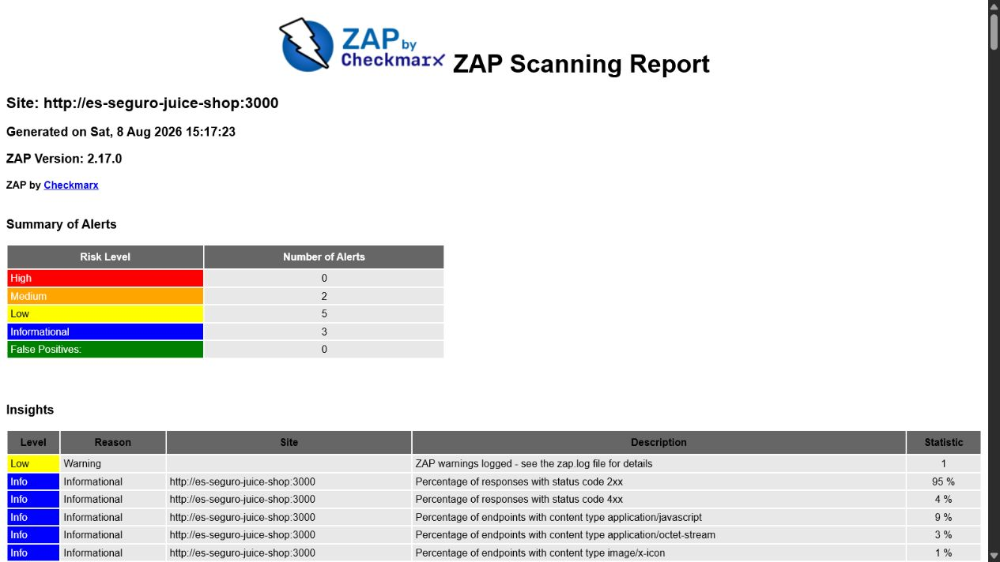

# Seção 15 — Verificação de Vulnerabilidades

> **Arquivo de trabalho individual:** este arquivo corresponde à Seção 15 do documento principal [`docs/modelagem-de-ameacas.md`](../../modelagem-de-ameacas.md).

---

## 15. Verificação de Vulnerabilidades

Esta seção apresenta uma sessão autorizada de verificação de vulnerabilidades no **OWASP Juice Shop**, aplicação deliberadamente vulnerável destinada a treinamento. A ferramenta utilizada foi o **OWASP ZAP**, conforme recomendado no enunciado da disciplina.

O teste ficou restrito a uma instância local em contêiner Docker. A sessão definitiva empregou o **ZAP Baseline Scan**, que executou spider tradicional e análise passiva, sem enviar cargas de exploração ativa.

### 15.1 Ambiente e configuração

| Item | Configuração |
| :--- | :--- |
| Ambiente | OWASP Juice Shop `20.1.1` |
| Ferramenta | OWASP ZAP `2.17.0` |
| Modalidade | Baseline Scan: spider de 1 minuto e análise passiva |
| Alvo interno | `http://es-seguro-juice-shop:3000` |
| Acesso pelo host | `http://127.0.0.1:3000` |
| Período | 08/08/2026, das 12:16:27 às 12:17:30 (`UTC−03:00`) |
| Escopo | Instância local e autorizada para treinamento |

A configuração detalhada, os identificadores imutáveis das imagens Docker e as limitações da execução estão no [relatório metodológico](../../../evidencias/etapa-5/relatorio-da-verificacao.md). A sessão preservou o [relatório HTML](../../../evidencias/etapa-5/relatorios/relatorio-zap.html), o [relatório JSON](../../../evidencias/etapa-5/relatorios/relatorio-zap.json), o [log integral](../../../evidencias/etapa-5/relatorios/log-da-execucao.txt) e o arquivo [`zap.yaml`](../../../evidencias/etapa-5/relatorios/zap.yaml) gerado pelo ZAP.

### 15.2 Resultado geral

A execução observou `158` URLs e encerrou com `59` regras aprovadas, `8` identificadores de regra com aviso e nenhuma regra configurada como falha. O código de saída `2` do Baseline Scan representa a presença de avisos sem falhas.

O relatório HTML apresenta dez entradas nomeadas: `2` de risco médio, `5` de risco baixo e `3` informativas. A diferença entre dez entradas e oito identificadores ocorre porque os plugins `90004` e `10049` possuem duas variações de alerta cada.



### 15.3 Achados selecionados

| ID | Alerta ou achado | Evidência | Possível impacto | Relação com OWASP ou CWE | Correção proposta |
| :---: | :--- | :--- | :--- | :--- | :--- |
| `A01` | Cabeçalho `Content-Security-Policy` ausente | Plugin `10038`; risco médio; confiança alta; 4 instâncias; [captura](../../../evidencias/etapa-5/capturas-de-tela/03-achado-a01.png) | Ausência de uma camada de defesa que restringe as fontes de scripts e outros recursos, ampliando o impacto potencial de injeções de conteúdo e XSS | [OWASP Top 10:2025 A02 — Security Misconfiguration](https://owasp.org/Top10/2025/A02_2025-Security_Misconfiguration/) e [CWE-693](https://cwe.mitre.org/data/definitions/693.html) | Implantar CSP inicialmente em modo `Report-Only`, corrigir violações legítimas e então habilitar uma política restritiva com `default-src`, `script-src`, `object-src`, `base-uri` e `frame-ancestors` |
| `A02` | CORS excessivamente permissivo | Plugin `10098`; risco médio; confiança média; `Access-Control-Allow-Origin: *` em 1 recurso JavaScript; [captura](../../../evidencias/etapa-5/capturas-de-tela/04-achado-a02.png) | Qualquer origem pode ler o recurso público observado; se a mesma política alcançar APIs sem autenticação com dados sensíveis, poderá ocorrer divulgação entre origens | [OWASP Top 10:2025 A02](https://owasp.org/Top10/2025/A02_2025-Security_Misconfiguration/) e [CWE-942](https://cwe.mitre.org/data/definitions/942.html) | Remover CORS onde não for necessário; nos endpoints que exigirem compartilhamento, usar lista explícita de origens e `Vary: Origin`, com testes separados para recursos públicos e autenticados |
| `A03` | Cabeçalho obsoleto `Feature-Policy` | Plugin `10063`; risco baixo; confiança média; 5 instâncias; [captura](../../../evidencias/etapa-5/capturas-de-tela/05-achado-a03.png) | Navegadores podem ignorar a política antiga, deixando APIs sensíveis sem as restrições de câmera, microfone ou geolocalização esperadas | [OWASP Top 10:2025 A02](https://owasp.org/Top10/2025/A02_2025-Security_Misconfiguration/) e [CWE-16](https://cwe.mitre.org/data/definitions/16.html) | Substituir `Feature-Policy` por `Permissions-Policy` e negar por padrão os recursos não utilizados, por exemplo `camera=(), microphone=(), geolocation=()` |

### 15.4 Análise do A01 — Content Security Policy ausente

O ZAP encontrou quatro respostas sem o cabeçalho `Content-Security-Policy`, incluindo a raiz da aplicação. A confiança alta indica que a ausência do cabeçalho foi observada diretamente; não significa, porém, que uma vulnerabilidade XSS tenha sido explorada. O achado registra a falta de uma defesa adicional do navegador.

No contexto do **ThesisFlow**, o controle se relaciona ao risco `R01`, pois uma injeção de script bem-sucedida poderia contribuir para o acesso a dados da sessão. O plano de tratamento da Etapa 2 já propõe cabeçalhos CSP no frontend, tornando o achado uma evidência prática da necessidade daquele controle.

A correção deve ser gradual para evitar quebrar recursos legítimos. Recomenda-se observar primeiro uma política em `Content-Security-Policy-Report-Only`, inventariar origens necessárias e, depois, aplicar a política definitiva. Uma base de endurecimento seria:

```http
Content-Security-Policy: default-src 'self'; object-src 'none'; base-uri 'self'; frame-ancestors 'none'
```

As diretivas de scripts, estilos, imagens e conexões devem ser ajustadas às dependências reais. Nonces ou hashes são preferíveis a liberar scripts inline de forma ampla.

### 15.5 Análise do A02 — CORS excessivamente permissivo

A evidência concreta foi `Access-Control-Allow-Origin: *` na resposta do recurso público `/chunk-VS3A3LTT.js`. O relatório gerado identifica `CWE-264`, um agrupamento genérico usado pelo plugin; para a classificação atual, a condição é descrita com mais precisão por `CWE-942`, que trata de políticas entre domínios permissivas.

O recurso observado é JavaScript estático e não contém, por si só, uma resposta autenticada. Portanto, o teste não comprovou exposição de dados confidenciais nem leitura com credenciais. O risco prático desta instância é menor do que o nível genérico do alerta. Ainda assim, a configuração deve ser revisada porque sua reutilização em endpoints que retornem dados sem autenticação poderia ampliar riscos de divulgação, inclusive condições relacionadas a `R07` e `R08`.

A correção consiste em aplicar CORS somente onde houver uma necessidade arquitetural. APIs privadas devem aceitar apenas as origens conhecidas do frontend. Quando a origem for selecionada dinamicamente a partir de uma lista permitida, a resposta também deve enviar `Vary: Origin`. O caractere curinga deve ficar restrito a recursos deliberadamente públicos e sem credenciais.

### 15.6 Análise do A03 — Feature Policy obsoleta

O ZAP observou o cabeçalho `Feature-Policy` em cinco recursos. A especificação atual utiliza o nome `Permissions-Policy` e uma sintaxe diferente. Manter apenas o cabeçalho antigo pode produzir uma falsa expectativa de proteção quando o navegador não o interpreta.

Não houve demonstração de uso indevido de câmera, microfone, geolocalização ou outra API controlada. O achado é preventivo, de risco baixo, e se relaciona ao `CWE-16` e ao endurecimento de configuração da categoria A02:2025.

A migração deve começar pelo inventário das funcionalidades realmente necessárias. Recursos não utilizados devem ser negados por padrão, e permissões indispensáveis devem ser concedidas ao menor conjunto possível de origens e frames.

### 15.7 Priorização, limitações e possíveis falsos positivos

A ordem proposta de tratamento é `A01` → `A02` → `A03`. O A01 combina risco médio, confiança alta e presença em múltiplas respostas. O A02 também é médio, mas apareceu em um recurso público e sem credenciais, o que reduz seu impacto confirmado. O A03 exige modernização, porém não demonstrou exploração e foi classificado como baixo.

Nenhum achado crítico ou alto foi produzido pela sessão. Os alertas passivos identificam condições observáveis, mas não comprovam exploração. Em particular:

- o A01 confirma a ausência de CSP, não a existência de XSS;
- o A02 confirma o curinga em um recurso estático, não o vazamento de dados autenticados;
- o A03 confirma um cabeçalho obsoleto, não o acesso indevido a uma API do navegador;
- a navegação sem autenticação não cobriu fluxos protegidos;
- o spider tradicional pode deixar rotas de uma aplicação de página única sem cobertura;
- as duas tentativas de Full Scan foram descartadas por falta de memória e não integram os resultados.

Os alertas informativos, as variantes duplicadas e os avisos de baixa confiança não foram priorizados porque os três achados escolhidos oferecem evidências mais claras e correções diretamente verificáveis. Uma nova sessão deverá ser executada após as correções para confirmar a ausência dos alertas sem introduzir regressões.

### 15.8 Referências

- [ZAP — Content Security Policy Header Not Set (plugin 10038)](https://www.zaproxy.org/docs/alerts/10038/)
- [ZAP — Cross-Domain Misconfiguration (plugin 10098)](https://www.zaproxy.org/docs/alerts/10098/)
- [ZAP — Permissions Policy Header Not Set (plugin 10063)](https://www.zaproxy.org/docs/alerts/10063/)
- [OWASP Top 10:2025 — A02 Security Misconfiguration](https://owasp.org/Top10/2025/A02_2025-Security_Misconfiguration/)
- [MDN — Content-Security-Policy](https://developer.mozilla.org/en-US/docs/Web/HTTP/Reference/Headers/Content-Security-Policy)
- [MDN — Cross-Origin Resource Sharing](https://developer.mozilla.org/en-US/docs/Web/HTTP/Guides/CORS)
- [MDN — Permissions Policy](https://developer.mozilla.org/en-US/docs/Web/HTTP/Guides/Permissions_Policy)
- [CWE-693 — Protection Mechanism Failure](https://cwe.mitre.org/data/definitions/693.html)
- [CWE-942 — Permissive Cross-domain Security Policy with Untrusted Domains](https://cwe.mitre.org/data/definitions/942.html)
- [CWE-16 — Configuration](https://cwe.mitre.org/data/definitions/16.html)
