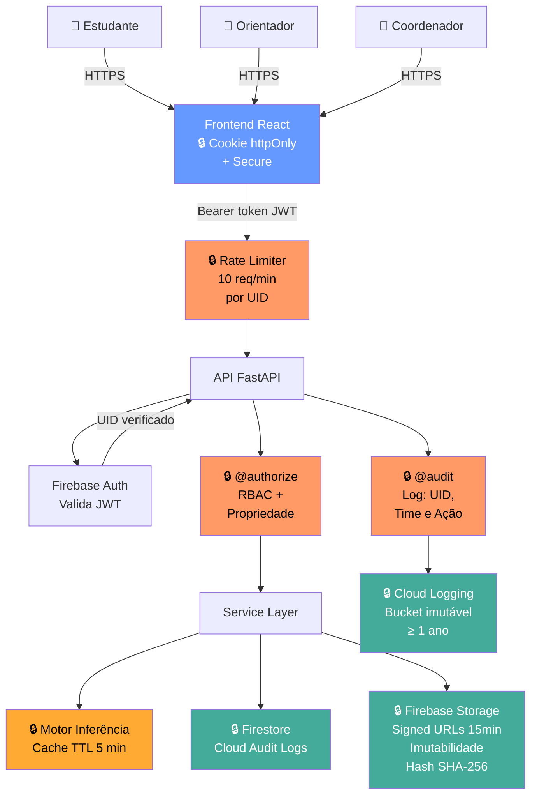

# ThesisFlow — Modelagem de Ameaças e Análise de Riscos de Segurança

**Grupo 06 — Engenharia de Software Seguro — UNIPAMPA**

> **Aviso de Navegação:** Este documento é o arquivo principal do trabalho. Cada seção está disponível também em arquivo individual na pasta [`docs/etapas/`](etapas/) para facilitar a colaboração e os commits individuais. O conteúdo completo e final está consolidado abaixo.

---

## Índice

### Etapa 1 — Casos de Abuso e Modelagem de Ameaças com STRIDE

| # | Seção | Arquivo de trabalho |
| :---: | :--- | :--- |
| `1` | [Identificação e descrição do sistema](#1-identificação-do-sistema) | [`sec1-identificacao-descricao.md`](etapas/etapa-1/sec1-identificacao-descricao.md) |
| `2` | [Usuários, ativos e pontos de interação](#3-usuários-ativos-e-pontos-de-interação) | [`sec2-usuarios-ativos.md`](etapas/etapa-1/sec2-usuarios-ativos.md) |
| `3` | [Visão geral da arquitetura](#4-visão-geral-da-arquitetura) | [`sec3-arquitetura.md`](etapas/etapa-1/sec3-arquitetura.md) |
| `4` | [Modelagem de ameaças com STRIDE](#5-modelagem-de-ameaças-com-stride) | [`sec4-stride.md`](etapas/etapa-1/sec4-stride.md) |
| `5` | [Casos de abuso](#6-casos-de-abuso) | [`sec5-casos-de-abuso.md`](etapas/etapa-1/sec5-casos-de-abuso.md) |
| `6` | [Considerações finais](#7-considerações-finais) | [`sec6-consideracoes.md`](etapas/etapa-1/sec6-consideracoes.md) |

### Etapa 2 — Análise, Priorização e Tratamento de Riscos com o NIST CSF

| # | Seção | Arquivo de trabalho |
| :---: | :--- | :--- |
| `7` | [Critérios de avaliação de risco](#7-critérios-de-avaliação-de-risco) | [`sec7-criterios-avaliacao.md`](etapas/etapa-2/sec7-criterios-avaliacao.md) |
| `8` | [Registro de riscos](#8-registro-de-riscos) | [`sec8-registro-de-riscos.md`](etapas/etapa-2/sec8-registro-de-riscos.md) |
| `9` | [Priorização dos riscos](#9-priorização-dos-riscos) | [`sec9-priorizacao-riscos.md`](etapas/etapa-2/sec9-priorizacao-riscos.md) |
| `10` | [Tratamento dos riscos e NIST CSF 2.0](#10-tratamento-dos-riscos-e-mapeamento-para-o-nist-csf-20) | [`sec10-tratamento-nist-csf.md`](etapas/etapa-2/sec10-tratamento-nist-csf.md) |
| `11` | [Considerações finais da Etapa 2](#11-considerações-finais-da-etapa-2) | [`sec11-consideracoes-finais-etapa2.md`](etapas/etapa-2/sec11-consideracoes-finais-etapa2.md) |

### Etapa 3 — Projeto de uma Arquitetura Segura

| # | Seção | Arquivo de trabalho |
| :---: | :--- | :--- |
| `12` | [Requisitos de segurança e vulnerabilidades catalogadas](#12-requisitos-de-segurança-e-mapeamento-de-vulnerabilidades-catalogadas) | [`sec12-requisitos-vulnerabilidades.md`](etapas/etapa-3/sec12-requisitos-vulnerabilidades.md) |
| `13` | [Diagrama da arquitetura segura e decisões de arquitetura](#13-diagrama-da-arquitetura-segura-e-decisões-de-arquitetura) | [`sec13-arquitetura-segura.md`](etapas/etapa-3/sec13-arquitetura-segura.md) |

### Etapa 4 — Código Seguro e Testes de Segurança

| # | Seção | Arquivo de trabalho |
| :---: | :--- | :--- |
| `14` | [Práticas de código seguro e testes de segurança](#14-práticas-de-código-seguro-e-testes-de-segurança) | [`sec14-codigo-seguro.md`](etapas/etapa-4/sec14-codigo-seguro.md) |

### Etapa 5 — Verificação de Vulnerabilidades

| # | Seção | Arquivo de trabalho |
| :---: | :--- | :--- |
| `15` | [Verificação de vulnerabilidades](#15-verificação-de-vulnerabilidades) | [`sec15-verificacao-vulnerabilidades.md`](etapas/etapa-5/sec15-verificacao-vulnerabilidades.md) |

### Etapa 6 — Monitoramento e Detecção de Intrusões

| # | Seção | Arquivo de trabalho |
| :---: | :--- | :--- |
| `16` | [Roteiro de monitoramento e detecção de intrusões](#etapa-6--monitoramento-e-detecção-de-intrusões) | [`etapa-6-deteccao-de-intrusoes.md`](../roteiros/etapa-6-deteccao-de-intrusoes.md) |

---
---

## Etapa 1 — Casos de Abuso e Modelagem de Ameaças com STRIDE

---

## 1. Identificação do sistema

- **Nome do sistema:** **ThesisFlow** — Sistema de Acompanhamento de Mestrado
- **Integrantes do grupo:**
  - Artur Wahlbrink Kraemer
  - Marcus Vinicius Morini Querol Junior
  - Bernardo Gomes Dorneles
  - Gustavo Fernandes dos Anjos
  - Fade Hassan Husein Kanaan
  - Rodrigo Thoma da Silva
- **Repositório:** [https://github.com/fadekanaan/es-seguro-gp06](https://github.com/fadekanaan/es-seguro-gp06)
- **Justificativa:** O **ThesisFlow** foi escolhido por ser um sistema real desenvolvido pelo próprio grupo durante a disciplina de Engenharia de Software no mesmo semestre. Isso nos permite realizar uma análise contextualizada e aprofundada, pois conhecemos em detalhes sua arquitetura, seus componentes, os dados que armazena e como os usuários interagem com ele. O sistema reúne múltiplos perfis de usuário, armazena dados pessoais e acadêmicos sensíveis, realiza autenticação, controla permissões e integra serviços externos — tornando-o um objeto de estudo rico para a análise de segurança com `STRIDE` e `NIST CSF`.

---

## 2. Descrição do sistema

O **ThesisFlow** é um sistema de acompanhamento acadêmico voltado a programas de mestrado com duração de 24 meses. Seu objetivo é auxiliar estudantes, orientadores e coordenadores no acompanhamento do progresso acadêmico ao longo de todo o curso, cobrindo plano de trabalho, tarefas, atividades creditáveis, validação de créditos, prazos, status acadêmico e requisitos para a defesa de dissertação.

### Problema que o sistema resolve

Programas de pós-graduação exigem que os estudantes cumpram uma série de requisitos ao longo dos meses: completar um número mínimo de créditos, registrar atividades acadêmicas com comprovação, cumprir marcos do plano de trabalho e submeter produções científicas. Sem um sistema centralizado, esse acompanhamento é fragmentado, dependente de planilhas, e-mails e processos manuais sujeitos a erros. O **ThesisFlow** centraliza esse processo em uma plataforma web segura e auditável.

### Quem utiliza o sistema

| Perfil | Descrição |
| :---: | :--- |
| **Estudante** | Matriculado no programa de mestrado. Registra atividades, faz upload de comprovantes, acompanha seu plano de trabalho e consulta seu status acadêmico. |
| **Orientador** | Professor responsável por um ou mais estudantes. Valida atividades creditáveis, acompanha o progresso do orientando e registra produções científicas. |
| **Coordenador** | Responsável pela administração do programa. Gerencia cadastros de usuários, define tipos de atividades creditáveis, aprova extensões de prazo, emite relatórios gerenciais e configura políticas acadêmicas. |

### Principais funcionalidades

- Cadastro e gerenciamento de estudantes, orientadores e coordenadores
- Registro e acompanhamento do plano de trabalho e suas etapas
- Registro de atividades creditáveis com upload de comprovantes (artigos, certificados, diplomas)
- Validação de créditos por orientadores
- Inferência automática do status acadêmico via motor lógico interno
- Geração de alertas automáticos sobre prazos e pendências
- Emissão de relatórios gerenciais para coordenadores
- Registro de produções científicas com classificação por tipo e período

### Informações armazenadas e transmitidas

- Dados pessoais dos estudantes (nome, e-mail, matrícula)
- Credenciais de acesso (gerenciadas pelo `Firebase Authentication`)
- Planos de trabalho com datas, etapas e prazos
- Registros de atividades creditáveis com comprovantes em arquivo (`Firebase Storage`)
- Produções científicas com metadados de autoria e *venue*
- Histórico de validações e aprovações
- Logs de auditoria de todas as operações sensíveis
- Status acadêmico inferido (regular, em risco, apto para defesa, etc.)
- Relatórios gerenciais com dados agregados de todo o programa

### Recursos que precisam ser protegidos

- Credenciais de autenticação
- Dados pessoais dos estudantes
- Comprovantes e documentos (arquivos no `Firebase Storage`)
- Registros de validação e aprovação de créditos
- Logs de auditoria
- Status acadêmico de cada estudante
- Planos de trabalho e prazos
- Permissões e papéis de acesso (`RBAC`)

---

## 3. Usuários, ativos e pontos de interação

### 3.1 Usuários e perfis de acesso

| Usuário | Papel no sistema | Principais ações |
| :--- | :---: | :--- |
| **Estudante** | `student` | Registrar atividades, fazer upload de comprovantes, consultar plano de trabalho, acompanhar status acadêmico |
| **Orientador** | `advisor` | Validar atividades creditáveis, acompanhar progresso do orientando, registrar produções científicas |
| **Coordenador** | `coordinator` | Gerenciar usuários e papéis, definir tipos de atividades, aprovar extensões de prazo, emitir relatórios |
| **Administrador de sistema** | acesso via *bootstrap* | Criar a conta inicial de coordenador via script privilegiado (`bootstrap_admin.py`) |

### 3.2 Dados pessoais e sensíveis

| Dado | Quem tem acesso | Por quê é sensível |
| :--- | :--- | :--- |
| Nome, e-mail e matrícula do estudante | Orientador, Coordenador, o próprio estudante | Dados pessoais protegidos pela `LGPD` |
| Credenciais de acesso (token `JWT`) | Usuário e `Firebase Auth` | Permitem acesso total à conta se comprometidos |
| Comprovantes de atividade (arquivos) | Estudante (upload), Orientador (validação) | Podem conter diplomas, certidões, artigos não publicados |
| Produções científicas e publicações | Orientador, Coordenador | Podem incluir trabalhos ainda não publicados |
| Status acadêmico inferido | Coordenador, Orientador, Estudante | Revela situação de risco ou atraso |
| Histórico de aprovações e validações | Coordenador, Orientador | Permite rastrear responsabilidades |
| Logs de auditoria | Coordenador, Administrador | Registros de todas as operações sensíveis |

### 3.3 Ativos importantes

Os ativos listados abaixo podem causar prejuízo significativo caso sejam acessados, alterados, destruídos ou indisponibilizados de forma indevida:

1. **Credenciais e tokens de autenticação** — comprometê-los permite assumir a identidade de qualquer usuário.
2. **Dados pessoais dos estudantes** — exposição viola privacidade e pode acarretar consequências legais (`LGPD`).
3. **Comprovantes de atividades creditáveis** — falsificação pode levar à validação indevida de créditos.
4. **Registros de validação e aprovação** — alteração pode modificar o progresso acadêmico de um estudante.
5. **Planos de trabalho e prazos** — adulteração pode mascarar atrasos ou criar inconsistências.
6. **Logs de auditoria** — sem eles, não é possível responsabilizar autores de operações incorretas.
7. **Status acadêmico inferido** — alteração pode permitir que estudantes inelegíveis avancem para a defesa.
8. **Permissões e papéis (`RBAC`)** — elevação indevida de privilégios compromete toda a segurança.

### 3.4 Pontos de interação e componentes

| Componente | Função | Tecnologia |
| :--- | :--- | :--- |
| **Frontend React** | Interface web utilizada pelos usuários | `React 18` + `TypeScript` + `Vite` |
| **API REST (backend)** | Processa todas as regras de negócio e operações | `FastAPI` (`Python 3.11+`) |
| **Firebase Authentication** | Valida identidade e emite tokens `JWT` | `Firebase Auth` (Google) |
| **Firestore** | Armazena todos os dados estruturados do sistema | `Firebase Firestore` (NoSQL) |
| **Firebase Storage** | Armazena os arquivos comprovantes das atividades | `Firebase Storage` (Google) |
| **Motor de inferência lógica** | Infere status acadêmico via cláusulas Horn | Implementação própria em `Python` |
| **Aspecto `@authorize`** | Controla acesso baseado em papel (`RBAC`) | Decorator `Python` (*before advice*) |
| **Aspecto `@audit`** | Registra todas as operações sensíveis | Decorator `Python` + `inspect` (*after advice*) |
| **Aspecto `@trigger_alerts`** | Envia notificações automáticas | Decorator `Python` (*after advice*) |

---

## 4. Visão geral da arquitetura

O **ThesisFlow** segue uma arquitetura em camadas estrita: `Router` → `Service` → `Repository` → `Infrastructure`. O frontend `React` se comunica com o backend `FastAPI` via `HTTP REST`. A autenticação é delegada ao `Firebase Authentication`, que emite tokens `JWT` verificados pela API a cada requisição. Os dados persistidos ficam no `Firestore`. Arquivos de comprovantes são armazenados no `Firebase Storage`.

A segurança da API é reforçada pelo aspecto `@authorize`, que valida o papel do usuário autenticado antes de qualquer operação sensível. O aspecto `@audit` registra automaticamente todas as operações de criação e alteração de dados.

### Diagrama de Contexto


*Figura 1: Diagrama de Contexto do sistema ThesisFlow*

### Diagrama de Fluxo de Dados

O diagrama abaixo ilustra dois fluxos críticos para a segurança: a autenticação/autorização e o registro de atividade com upload de comprovante.


*Figura 2: Diagrama de Fluxo de Dados (Autenticação, Autorização e Upload de Comprovante)*

### Visão simplificada da arquitetura

```text
Usuário (browser)
       │
       ▼
Frontend React
       │ HTTP + Bearer token JWT
       ▼
API FastAPI ──────────────────────────────────────────────────┐
  │ @authorize → verifica role (RBAC)                         │
  │ @audit     → registra operação                            │
  │ @trigger_alerts → notifica partes interessadas            │
  │                                                           │
  ├─▶ Service Layer (regras de negócio)                       │
  │       └─▶ resolver.query() → Motor Lógico (inferência)   │
  │       └─▶ Repository → Firestore (dados estruturados)     │
  │       └─▶ Firebase Storage (comprovantes)                 │
  │                                                           │
  └─▶ Firebase Authentication (validação de token JWT) ───────┘
```

---

## 5. Modelagem de ameaças com STRIDE

A análise `STRIDE` foi aplicada aos componentes e ativos do **ThesisFlow**. Para cada categoria, foram identificadas ameaças concretas e relacionadas ao funcionamento do sistema.

| ID | Categoria STRIDE | Componente ou ativo | Ameaça identificada | Possível impacto |
| :---: | :---: | :--- | :--- | :--- |
| `T01` | **Spoofing** | `Firebase Auth` / Token `JWT` | Um atacante rouba ou captura o token `JWT` de um usuário autenticado (via `XSS`, interceptação ou vazamento) e passa a utilizá-lo para autenticar requisições como se fosse a vítima | Acesso completo à conta: leitura de dados, upload de arquivos, validação de atividades em nome de outro usuário |
| `T02` | **Spoofing** | Cadastro de orientador | Um usuário se cadastra como orientador informando dados falsos de vínculo institucional, pois o sistema não valida o vínculo real com a universidade | Acesso a dados privados de estudantes, possibilidade de validar créditos indevidamente como se fosse um professor legítimo |
| `T03` | **Tampering** | Comprovantes no `Firebase Storage` | Um estudante substitui o arquivo de comprovante legítimo por um documento forjado após o upload, explorando a URL de acesso ao `Storage` sem restrição de imutabilidade | Validação de atividade creditável com documento falso, obtendo créditos indevidos |
| `T04` | **Tampering** | Plano de trabalho e prazos | Um usuário com acesso indevido à API altera datas de prazo ou marcos do plano de trabalho de um estudante, modificando o registro sem autorização | Mascaramento de atrasos acadêmicos, geração de inconsistências no histórico e dificuldade de auditoria posterior |
| `T05` | **Repudiation** | Logs de auditoria (`@audit`) | O aspecto de auditoria é desabilitado em tempo de execução (via flag `ASPECTS_ENABLED`) ou os logs são apagados/alterados; um orientador nega ter aprovado determinada atividade | Impossibilidade de responsabilizar o autor de uma operação, dificultando investigação de fraudes acadêmicas |
| `T06` | **Repudiation** | Operações de coordenador | Um coordenador realiza uma operação administrativa (ex.: aprovação de extensão de prazo) e, na ausência de log imutável com identificação completa, nega posteriormente ter realizado a ação | Contestações sem evidências, comprometimento da responsabilização institucional |
| `T07` | **Information Disclosure** | API REST / `Firestore` | Um estudante autenticado modifica o identificador de outro estudante em uma requisição `GET` (ataque IDOR — *Insecure Direct Object Reference*), e a API retorna dados do outro estudante sem verificar a propriedade do recurso | Exposição de dados pessoais, plano de trabalho, status acadêmico e produção científica de terceiros |
| `T08` | **Information Disclosure** | `Firebase Storage` | A URL de download de um comprovante armazenado no `Firebase Storage` não exige autenticação para ser acessada; a URL é compartilhada ou descoberta por terceiros | Exposição de documentos pessoais sensíveis (diplomas, certidões, artigos não publicados) |
| `T09` | **Denial of Service** | API FastAPI / Motor lógico | Um atacante envia um grande volume de requisições a endpoints que invocam o motor de inferência lógica, que realiza operações computacionalmente intensas sem limitação de taxa | Degradação ou indisponibilidade do sistema durante períodos críticos (ex.: período de qualificações e defesas) |
| `T10` | **Denial of Service** | `Firebase Storage` | Um usuário autenticado realiza upload massivo de arquivos de grande volume, esgotando a cota de armazenamento do plano Firebase utilizado pelo sistema | Bloqueio de uploads legítimos de outros estudantes, impossibilitando o envio de comprovantes |
| `T11` | **Elevation of Privilege** | Aspecto `@authorize` (`RBAC`) | Um estudante autenticado manipula uma requisição HTTP para chamar diretamente um endpoint restrito a coordenadores (ex.: `POST /activity-types`), explorando falha na verificação de papel ou ausência do decorator | Acesso a funções administrativas: criação de tipos de atividades, aprovação de extensões, acesso a relatórios gerenciais |
| `T12` | **Elevation of Privilege** | Script `bootstrap_admin.py` | O script de criação da conta inicial de coordenador fica acessível ou executável remotamente em ambiente de produção (ex.: via endpoint não autenticado, variável de ambiente exposta ou acesso indevido ao servidor) | Criação de uma conta de coordenador com privilégios máximos por um atacante externo, comprometendo toda a segurança do sistema |

### 5.1 Interpretação da análise

> **Nota de Análise:** As doze ameaças identificadas abrangem todas as seis categorias do `STRIDE` no contexto específico do **ThesisFlow**. As ameaças de **Spoofing** comprometem a identidade dos usuários e a confiança nas ações realizadas. O **Tampering** afeta a integridade dos dados acadêmicos e dos comprovantes, que são a base para decisões importantes de validação. A **Repudiation** prejudica a capacidade de auditoria e responsabilização — especialmente crítica em um contexto acadêmico formal. A **Information Disclosure** expõe dados pessoais protegidos pela `LGPD`. O **Denial of Service** pode impedir o uso do sistema em momentos críticos do calendário acadêmico. Por fim, a **Elevation of Privilege** pode comprometer toda a estrutura de controle de acesso do sistema.

---

## 6. Casos de abuso

### Diagrama de Casos de Abuso


*Figura 3: Diagrama de Casos de Abuso do sistema ThesisFlow*

---

### CA01 — Forja de comprovante para validação indevida de créditos

| Atributo | Detalhes |
| :---: | :--- |
| **Identificador** | `CA01` |
| **Ator Malicioso** | Estudante mal-intencionado |
| **Objetivo do Abuso** | Obter validação de créditos por meio de um comprovante falso ou de um documento legítimo de outra pessoa |
| **Condições Necessárias** | • O sistema aceita upload de arquivos sem verificar o conteúdo ou autenticidade do documento.<br>• A URL de acesso ao arquivo no `Firebase Storage` não possui controle de imutabilidade após o upload.<br>• O orientador não possui mecanismo de verificação adicional além da visualização do arquivo. |
| **Categorias STRIDE** | **Tampering**, **Repudiation** |

#### Fluxo do Abuso

1. O estudante registra uma atividade creditável no sistema com dados corretos (tipo, descrição, data).
2. O estudante faz upload de um comprovante que pode ser falso (documento adulterado) ou de terceiro (comprovante roubado ou copiado).
3. O sistema aceita o arquivo e associa a URL ao registro da atividade.
4. O orientador recebe notificação e visualiza o arquivo — que aparenta ser legítimo.
5. O orientador valida a atividade sem perceber a fraude.
6. O sistema registra os créditos como válidos na conta do estudante.

> **Impacto Estimado:** O estudante obtém créditos acadêmicos sem ter realizado a atividade correspondente, o que compromete a integridade do programa e pode permitir que ele avance para a defesa sem cumprir os requisitos reais.

---

### CA02 — Acesso indevido a dados de outro estudante via IDOR

| Atributo | Detalhes |
| :---: | :--- |
| **Identificador** | `CA02` |
| **Ator Malicioso** | Estudante autenticado no sistema |
| **Objetivo do Abuso** | Acessar informações privadas de outros estudantes — plano de trabalho, status acadêmico, produções registradas — sem autorização |
| **Condições Necessárias** | • A API não verifica se o recurso solicitado pertence ao usuário autenticado.<br>• Os identificadores de recursos (IDs de estudante, IDs de atividade) são sequenciais ou previsíveis.<br>• A resposta da API retorna o objeto completo sem filtragem por proprietário. |
| **Categorias STRIDE** | **Information Disclosure** |

#### Fluxo do Abuso

1. O estudante autentica-se normalmente com suas próprias credenciais.
2. O estudante acessa um recurso próprio e observa o identificador na URL (ex.: `GET /students/{student_id}/activities`).
3. O estudante modifica o identificador na requisição (ex.: incrementa o valor ou testa outros IDs).
4. A API processa a requisição sem verificar se o `student_id` pertence ao usuário autenticado.
5. O sistema retorna os dados do estudante correspondente ao ID modificado.
6. O estudante repete a operação sistematicamente, coletando dados de múltiplos estudantes.

> **Impacto Estimado:** Exposição de dados pessoais e acadêmicos de terceiros, violação de privacidade com implicações legais (`LGPD`), e possível uso das informações para fraudes ou pressão sobre outros estudantes.

---

### CA03 — Cadastro de falso orientador para obter acesso a dados de estudantes

| Atributo | Detalhes |
| :---: | :--- |
| **Identificador** | `CA03` |
| **Ator Malicioso** | Atacante externo que deseja se passar por orientador |
| **Objetivo do Abuso** | Obter o papel de orientador no sistema para acessar dados privados de estudantes e potencialmente validar atividades ou influenciar o progresso acadêmico de outros usuários |
| **Condições Necessárias** | • O sistema permite cadastro de orientadores sem validar o vínculo real com a instituição.<br>• O processo de criação de conta de orientador não exige confirmação por parte de um coordenador.<br>• O atacante consegue criar um e-mail com domínio institucional ou similar. |
| **Categorias STRIDE** | **Spoofing**, **Information Disclosure**, **Elevation of Privilege** |

#### Fluxo do Abuso

1. O atacante cria uma conta no `Firebase Authentication` com um e-mail plausível (ex.: com domínio institucional ou similar).
2. O atacante registra-se no sistema como orientador, informando dados falsos de nome e vínculo.
3. O sistema aceita o cadastro sem verificação adicional.
4. O atacante é associado a um ou mais estudantes como orientador.
5. O atacante passa a ter acesso aos dados pessoais, plano de trabalho e comprovantes dos estudantes orientados.
6. O atacante pode validar atividades indevidamente ou coletar dados para outros fins.

> **Impacto Estimado:** Exposição de dados pessoais de estudantes, comprometimento da confidencialidade de documentos acadêmicos, validações fraudulentas e perda de confiança no sistema.

---

### CA04 — Ataque de flooding ao motor de inferência durante período crítico

| Atributo | Detalhes |
| :---: | :--- |
| **Identificador** | `CA04` |
| **Ator Malicioso** | Atacante externo com acesso autenticado ou com credenciais comprometidas |
| **Objetivo do Abuso** | Tornar o sistema indisponível durante um período crítico do calendário acadêmico (ex.: período de qualificações, defesas ou entrega de relatórios semestrais) |
| **Condições Necessárias** | • O sistema não possui limitação de taxa de requisições (*rate limiting*) nos endpoints da API.<br>• O motor de inferência lógica realiza operações computacionalmente intensas a cada invocação.<br>• Não há mecanismo de cache para resultados já calculados recentemente. |
| **Categorias STRIDE** | **Denial of Service** |

#### Fluxo do Abuso

1. O atacante autentica-se no sistema com credenciais próprias ou roubadas.
2. O atacante identifica os endpoints que invocam o motor lógico (ex.: `GET /students/{id}/status`).
3. O atacante envia requisições em alta frequência para esses endpoints via script.
4. O motor de inferência é invocado repetidamente, consumindo CPU e memória do servidor.
5. O sistema começa a responder com lentidão ou erros para todos os usuários.
6. Estudantes e orientadores não conseguem acessar o sistema durante o período crítico.

> **Impacto Estimado:** Indisponibilidade do sistema, perda de prazos acadêmicos por parte de estudantes legítimos, aumento de carga administrativa e possível prejuízo ao calendário do programa.

---

### CA05 — Orientador nega ter aprovado validação de crédito

| Atributo | Detalhes |
| :---: | :--- |
| **Identificador** | `CA05` |
| **Ator Malicioso** | Orientador desonesto ou com interesses conflitantes |
| **Objetivo do Abuso** | Negar a responsabilidade por uma validação de crédito já realizada, seja para prejudicar o estudante, encobrir um erro próprio ou evitar consequências de uma aprovação indevida |
| **Condições Necessárias** | • O aspecto `@audit` pode ser desabilitado via flag de configuração (`ASPECTS_ENABLED["audit"] = False`).<br>• Os logs de auditoria não são imutáveis ou podem ser alterados por quem tem acesso ao banco de dados.<br>• Não há assinatura digital ou mecanismo criptográfico que vincule a validação ao orientador. |
| **Categorias STRIDE** | **Repudiation** |

#### Fluxo do Abuso

1. O orientador valida a atividade de um estudante no sistema.
2. O sistema registra a operação via `@audit`, associando-a ao token `JWT` do orientador.
3. Posteriormente, o orientador afirma não ter realizado a validação.
4. Se os logs forem incompletos, alteráveis ou sem identificação suficiente, não há prova da ação.
5. A contestação não pode ser resolvida, e o estudante pode ter seus créditos cancelados.

> **Impacto Estimado:** Prejuízo acadêmico direto ao estudante, impossibilidade de responsabilização do orientador e necessidade de processos administrativos para resolução da disputa.

---

### CA06 — Estudante eleva seus próprios privilégios para coordenador

| Atributo | Detalhes |
| :---: | :--- |
| **Identificador** | `CA06` |
| **Ator Malicioso** | Estudante com conhecimento técnico sobre APIs REST |
| **Objetivo do Abuso** | Contornar o controle de acesso baseado em papel (`RBAC`) para acessar funcionalidades restritas a coordenadores |
| **Condições Necessárias** | • Existe um endpoint administrativo sem o decorator `@authorize(role="coordinator")` ou com verificação insuficiente.<br>• O estudante consegue descobrir a URL de um endpoint restrito (via documentação Swagger em `/docs`, erros expostos ou análise de tráfego).<br>• O sistema não verifica consistência de papel no servidor além do token `JWT`. |
| **Categorias STRIDE** | **Elevation of Privilege**, **Tampering** |

#### Fluxo do Abuso

1. O estudante autentica-se normalmente.
2. O estudante explora a API buscando endpoints não protegidos (ex.: usando a documentação Swagger).
3. O estudante identifica o endpoint `POST /activity-types` ou similar.
4. O estudante envia uma requisição com seu token `JWT` de estudante para o endpoint restrito.
5. Se a verificação for ausente ou falha, o sistema processa a requisição.
6. O estudante cria ou altera configurações do sistema, afetando outros usuários.

> **Impacto Estimado:** Alteração de configurações do programa, criação de tipos de atividades falsas e comprometimento da integridade do sistema.

---

## Considerações finais

### Ameaças mais preocupantes

As ameaças consideradas mais críticas são a exposição de dados por IDOR (`T07`), o roubo de token `JWT` (`T01`) e a falsificação de comprovantes (`T03`). Essas ameaças afetam diretamente a integridade e a confidencialidade do sistema, podendo comprometer a validade do processo acadêmico.

A ameaça `T07` (IDOR) é particularmente preocupante porque exige pouco conhecimento técnico — qualquer estudante autenticado pode tentar modificar identificadores em requisições — e seu impacto é elevado, pois viola a privacidade de múltiplos usuários e pode gerar consequências legais conforme a `LGPD`.

A ameaça `T01` (roubo de token `JWT`) é crítica pela abrangência: um token de coordenador comprometido expõe todo o sistema administrativo, enquanto um token de orientador compromete os dados de todos os seus orientandos.

---

### Ativos mais importantes

Os ativos mais valiosos são as **credenciais de autenticação** (token `JWT`), os **comprovantes de atividades** (arquivos no `Firebase Storage`), os **registros de validação** e os **logs de auditoria**. Esses elementos são a base para todas as decisões acadêmicas tomadas pelo sistema — a integridade do diploma emitido ao final do programa depende diretamente da confiabilidade dessas informações.

---

### Tipos de abuso com maior impacto

Os casos de abuso com maior impacto potencial são:

- **`CA03` (falso orientador):** permite acesso prolongado e sistemático a dados de múltiplos estudantes, com grande dificuldade de detecção.
- **`CA01` (forja de comprovante):** compromete a validade acadêmica dos créditos validados, podendo levar um estudante a defender uma dissertação sem ter cumprido os requisitos reais.
- **`CA06` (elevação de privilégios):** compromete toda a estrutura de controle de acesso do sistema, permitindo alterações que afetam todos os usuários.

---

### Principais dificuldades encontradas

A maior dificuldade foi diferenciar ameaças genéricas de situações concretas e específicas ao **ThesisFlow**. O conhecimento profundo do sistema, por ter sido desenvolvido pelo grupo, facilitou a identificação de pontos realmente vulneráveis — como o flag `ASPECTS_ENABLED` que pode desabilitar a auditoria, ou a ausência de restrição de imutabilidade nos arquivos do `Storage`.

Outra dificuldade foi determinar o limite entre **ameaça** (o que pode acontecer), **vulnerabilidade** (a condição que permite) e **ataque** (a ação do agente malicioso). A utilização do `STRIDE` ajudou a estruturar essa análise por perspectivas distintas, revelando ameaças que poderiam não ser percebidas em uma análise apenas funcional.

Por fim, a categoria **Repudiation** foi a mais difícil de contextualizar, pois depende não apenas de uma falha técnica, mas também do comportamento dos usuários e da qualidade dos registros de auditoria — que no **ThesisFlow** podem ser desabilitados via configuração.

---
---

## Etapa 2 — Análise, Priorização e Tratamento de Riscos com o NIST CSF

---

## 7. Critérios de Avaliação de Risco

Esta seção define os critérios de probabilidade e impacto que serão aplicados a todas as ameaças identificadas na Etapa 1, transformando-as em eventos de risco mensuráveis e comparáveis. As escalas adotadas seguem as diretrizes da disciplina e são calibradas de acordo com o contexto específico do **ThesisFlow**.

---

### 7.1 Critérios de probabilidade

A escala de probabilidade reflete a facilidade com que um evento de risco pode ocorrer, considerando as condições técnicas do sistema, o perfil dos usuários, as vulnerabilidades existentes e o contexto de uso acadêmico.

| Valor | Classificação | Critério |
| :---: | :---: | :--- |
| `1` | Baixa | O evento depende de condições incomuns, acesso muito específico ou grande capacidade técnica |
| `2` | Média-baixa | O evento é possível, mas depende de uma vulnerabilidade ou condição específica |
| `3` | Média-alta | O evento é plausível e pode ocorrer em situações comuns de uso ou ataque |
| `4` | Alta | O evento pode ocorrer com facilidade, frequência ou durante condições previsíveis do sistema |

A probabilidade não é atribuída por intuição. Cada valor é justificado com base nas características do sistema, nas vulnerabilidades identificadas, nas condições de exploração e no contexto de uso do **ThesisFlow** (ver Seção 8).

---

### 7.2 Critérios de impacto

A escala de impacto reflete as consequências de um evento de risco bem-sucedido sobre os usuários, os dados, a integridade acadêmica e a conformidade legal do sistema.

| Valor | Classificação | Critério |
| :---: | :---: | :--- |
| `1` | Baixo | Causa pequeno transtorno e pode ser corrigido rapidamente |
| `2` | Moderado | Causa interrupção ou inconsistência limitada, com possibilidade de recuperação |
| `3` | Alto | Causa prejuízo relevante aos usuários, ao negócio, à administração ou à privacidade |
| `4` | Muito alto | Pode afetar muitos usuários, comprometer operações críticas ou causar prejuízo grave |

Na avaliação do impacto foram considerados: prejuízo direto aos usuários, exposição de dados pessoais protegidos pela `LGPD`, interrupção de operações críticas do calendário acadêmico, comprometimento da integridade das decisões de validação e dificuldade de recuperação.

---

### 7.3 Cálculo e classificação do nível de risco

A pontuação de cada risco é calculada pela seguinte fórmula:

```
Pontuação = Probabilidade × Impacto
```

O resultado é então classificado conforme a tabela abaixo:

| Pontuação | Nível do risco |
| :---: | :---: |
| `1 a 3` | **Baixo** |
| `4 a 7` | **Médio** |
| `8 a 11` | **Alto** |
| `12 a 16` | **Crítico** |

> A pontuação auxilia na comparação entre riscos, mas não substitui a análise contextual. Dois riscos com a mesma pontuação podem receber prioridades distintas em função da gravidade das consequências, das dependências entre componentes ou da dificuldade de recuperação (ver Seção 9).

---

## 8. Registro de Riscos

Cada ameaça identificada na Etapa 1 (T01–T12) originou pelo menos um evento de risco. Os Casos de Abuso (CA01–CA06) são referenciados como origens complementares onde a relação é direta. As avaliações de probabilidade e impacto aplicam os critérios definidos na Seção 7.

---

### 8.1 Tabela consolidada do Registro de Riscos

| ID | Origem | Evento de risco | Vulnerabilidade ou condição | Prob. | Impacto | Pont. | Nível |
| :---: | :---: | :--- | :--- | :---: | :---: | :---: | :---: |
| `R01` | T01 · Spoofing | Token JWT de usuário autenticado é roubado via XSS ou interceptação e utilizado por um atacante para operar como a vítima | Ausência de proteção contra XSS no frontend e ausência de mecanismo de revogação proativa de tokens | `3` | `4` | `12` | **Crítico** |
| `R02` | T02 · Spoofing · CA03 | Atacante se cadastra como orientador com dados falsos e obtém acesso aos dados de estudantes e à capacidade de validar créditos | Sistema não valida vínculo institucional do orientador nem exige aprovação de coordenador para ativação da conta | `3` | `3` | `9` | **Alto** |
| `R03` | T03 · Tampering · CA01 | Estudante substitui arquivo de comprovante após upload por documento forjado, obtendo validação de créditos indevidos | URL de acesso ao `Firebase Storage` não possui controle de imutabilidade após o upload inicial | `3` | `4` | `12` | **Crítico** |
| `R04` | T04 · Tampering | Usuário com acesso indevido à API altera datas ou marcos do plano de trabalho de um estudante sem autorização | Falha ou ausência do decorator `@authorize` em endpoints de atualização do plano de trabalho | `2` | `3` | `6` | **Médio** |
| `R05` | T05 · Repudiation · CA05 | Aspecto `@audit` é desabilitado via flag de configuração e orientador nega responsabilidade por validação já realizada | Flag `ASPECTS_ENABLED["audit"]` permite desativar a auditoria em tempo de execução sem controle de acesso | `2` | `4` | `8` | **Alto** |
| `R06` | T06 · Repudiation | Coordenador realiza operação administrativa (ex.: aprovação de extensão) e, na ausência de log imutável, nega tê-la realizado | Logs de auditoria podem ser alterados ou expurgados por quem detém acesso ao banco de dados | `2` | `3` | `6` | **Médio** |
| `R07` | T07 · Info. Disclosure · CA02 | Estudante autenticado enumera IDs de outros estudantes em requisições GET e coleta dados pessoais e acadêmicos de terceiros (IDOR) | API não verifica se o recurso solicitado pertence ao usuário autenticado, retornando o objeto completo sem filtragem | `3` | `4` | `12` | **Crítico** |
| `R08` | T08 · Info. Disclosure | URL de download de comprovante no `Firebase Storage` é descoberta ou compartilhada, expondo documentos pessoais sem autenticação | Regras do `Firebase Storage` não exigem autenticação para leitura, ou a URL de acesso não possui validade limitada | `3` | `3` | `9` | **Alto** |
| `R09` | T09 · Denial of Service · CA04 | Atacante envia volume massivo de requisições aos endpoints que invocam o motor de inferência lógica, degradando ou tornando o sistema indisponível | Ausência de *rate limiting* e de cache de resultados nos endpoints computacionalmente intensos | `3` | `3` | `9` | **Alto** |
| `R10` | T10 · Denial of Service | Usuário autenticado realiza upload massivo de arquivos de grande volume, esgotando a cota de armazenamento do Firebase | Ausência de limitação de tamanho de arquivo, de cota por usuário e de restrição por tipo de conteúdo no `Firebase Storage` | `2` | `2` | `4` | **Médio** |
| `R11` | T11 · Elevation of Privilege · CA06 | Estudante autenticado chama diretamente endpoint restrito a coordenadores, explorando ausência ou falha do decorator `@authorize` | Endpoint administrativo sem o decorator `@authorize(role="coordinator")` ou com verificação de papel insuficiente | `2` | `4` | `8` | **Alto** |
| `R12` | T12 · Elevation of Privilege | Script `bootstrap_admin.py` fica acessível ou executável em produção, permitindo criação de conta de coordenador por atacante externo | Script privilegiado exposto via endpoint não autenticado ou por acesso indevido ao servidor em ambiente de produção | `1` | `4` | `4` | **Médio** |

---

### 8.2 Justificativas das avaliações

As justificativas a seguir explicam, para cada risco, os critérios que motivaram os valores de probabilidade e impacto atribuídos.

---

#### R01 — Roubo de token JWT (T01)

- **Probabilidade 3 — Média-alta:** Ataques de XSS e interceptação de tokens são técnicas amplamente documentadas e utilizadas. O frontend `React` com `Vite` não garante proteção automática contra todos os vetores de XSS, especialmente em bibliotecas de terceiros ou renderização de conteúdo dinâmico. A ausência de mecanismo de revogação proativa torna o ataque sustentável por toda a validade do token.
- **Impacto 4 — Muito alto:** Um token comprometido concede ao atacante acesso completo à conta da vítima, permitindo realizar qualquer operação autorizada para aquele papel — incluindo validação de créditos (orientador), emissão de relatórios ou alteração de configurações (coordenador). O impacto se multiplica quando o token pertence a um perfil com privilégios elevados.
- **Relação com casos de abuso:** Esta ameaça habilita vários outros casos de abuso se o token pertencer a um orientador (CA05) ou coordenador (CA06).

---

#### R02 — Falso orientador (T02 · CA03)

- **Probabilidade 3 — Média-alta:** O cadastro de orientadores sem validação de vínculo institucional é uma falha explorada com técnicas simples: basta criar uma conta com e-mail plausível. Não há barreira técnica relevante impedindo o registro.
- **Impacto 3 — Alto:** O atacante obtém acesso prolongado aos dados pessoais, comprovantes e plano de trabalho de múltiplos estudantes, além da capacidade de aprovar atividades fraudulentamente. O impacto inclui violação de privacidade com implicações jurídicas (`LGPD`) e comprometimento da integridade acadêmica.

---

#### R03 — Substituição de comprovante forjado (T03 · CA01)

- **Probabilidade 3 — Média-alta:** A substituição de arquivo após upload é possível a qualquer estudante autenticado que conheça a URL de acesso ao `Storage`. Não há mecanismo de imutabilidade documentado que bloqueie essa operação.
- **Impacto 4 — Muito alto:** A fraude de comprovante compromete a validade dos créditos acadêmicos e pode permitir que um estudante avance para a defesa sem ter cumprido os requisitos reais. O dano é ao mesmo tempo acadêmico, institucional e difícil de detectar sem auditoria ativa.

---

#### R04 — Alteração indevida do plano de trabalho (T04)

- **Probabilidade 2 — Média-baixa:** A exploração depende de uma falha específica no controle de acesso (`@authorize` ausente ou falho) em endpoints de atualização do plano de trabalho. Esse vetor exige conhecimento técnico da API (ex.: Swagger exposto).
- **Impacto 3 — Alto:** A adulteração do plano de trabalho pode mascarar atrasos acadêmicos, criar inconsistências no histórico do estudante e dificultar a auditoria posterior. O dano afeta diretamente a confiabilidade das decisões do programa.

---

#### R05 — Desabilitação do aspecto de auditoria (T05 · CA05)

- **Probabilidade 2 — Média-baixa:** A exploração exige acesso privilegiado às configurações do sistema (variável `ASPECTS_ENABLED`), o que restringe o vetor a insiders ou a atacantes que já tenham comprometido o ambiente de execução. No entanto, a condição é uma vulnerabilidade de configuração real e documentada no código.
- **Impacto 4 — Muito alto:** A ausência de logs de auditoria elimina a capacidade de responsabilização por qualquer operação. Em um contexto acadêmico formal, a impossibilidade de comprovar quem realizou uma validação tem consequências institucionais e potencialmente jurídicas graves.

---

#### R06 — Repudiação de operação administrativa (T06)

- **Probabilidade 2 — Média-baixa:** Requer que o coordenador tenha motivação para negar a ação e que os logs sejam insuficientes ou alteráveis. A condição depende tanto de comportamento humano quanto de fragilidade técnica do log.
- **Impacto 3 — Alto:** A impossibilidade de comprovar uma decisão administrativa (ex.: aprovação de extensão de prazo) gera disputas sem resolução técnica, prejudicando estudantes e comprometendo a governança do programa.

---

#### R07 — IDOR para acesso a dados de terceiros (T07 · CA02)

- **Probabilidade 3 — Média-alta:** A técnica IDOR é trivial para qualquer estudante autenticado que observe o padrão de IDs nas requisições. Não requer ferramentas especializadas — basta modificar um valor na URL. Identificadores sequenciais ou UUIDs previsíveis ampliam o risco.
- **Impacto 4 — Muito alto:** A exploração permite enumeração sistemática dos dados de todos os estudantes do programa — dados pessoais, status acadêmico, plano de trabalho e comprovantes — configurando violação em massa com implicações diretas da `LGPD`.

---

#### R08 — URL de comprovante acessível sem autenticação (T08)

- **Probabilidade 3 — Média-alta:** URLs do `Firebase Storage` sem regras restritivas de leitura são acessíveis publicamente a qualquer um que as possua. O compartilhamento acidental (ex.: via e-mail, print de tela) ou a descoberta por varredura configuram um vetor de exploração plausível e recorrente.
- **Impacto 3 — Alto:** A exposição de comprovantes pode incluir diplomas, certidões, artigos científicos não publicados e documentos de identificação pessoal — todos sensíveis sob a `LGPD` e de valor para o titular.

---

#### R09 — Flooding do motor de inferência (T09 · CA04)

- **Probabilidade 3 — Média-alta:** O vetor de ataque é de baixa complexidade: qualquer usuário autenticado com um script básico pode disparar requisições em alta frequência. O motor de inferência, por seu custo computacional, é um alvo natural.
- **Impacto 3 — Alto:** A indisponibilidade durante períodos críticos do calendário acadêmico (defesas, qualificações, entrega de relatórios) pode causar perda de prazos, retrabalho administrativo e danos à reputação do sistema e do programa.

---

#### R10 — Upload massivo no Storage (T10)

- **Probabilidade 2 — Média-baixa:** Depende de um usuário autenticado com intenção maliciosa e conhecimento da API de upload. A ausência de limitação de tamanho facilita o ataque, mas o vetor é mais direto do que um ataque externo.
- **Impacto 2 — Moderado:** O impacto é limitado ao esgotamento da cota de armazenamento, bloqueando novos uploads legítimos. O serviço pode ser restaurado com ampliação de cota e remoção dos arquivos maliciosos, sem perda de dados existentes.

---

#### R11 — Elevação de privilégios via endpoint desprotegido (T11 · CA06)

- **Probabilidade 2 — Média-baixa:** A exploração depende da existência de um endpoint específico sem o decorator `@authorize` correto — uma falha pontual, não sistêmica. A documentação Swagger em `/docs`, quando exposta em produção, facilita a descoberta.
- **Impacto 4 — Muito alto:** O acesso a funções de coordenador permite alterar a estrutura do programa (tipos de atividades, configurações de crédito), aprovar extensões de prazo indevidamente e acessar relatórios gerenciais completos, comprometendo toda a integridade administrativa do sistema.

---

#### R12 — Exposição do script bootstrap_admin.py (T12)

- **Probabilidade 1 — Baixa:** A exposição do script em produção requer um erro de configuração de infraestrutura grave (endpoint não autenticado ativo ou acesso indevido ao servidor). Em implantações minimamente cuidadosas, o risco de exposição é baixo, pois o script deve ser executado apenas localmente na inicialização.
- **Impacto 4 — Muito alto:** Se explorado, permite a criação de uma conta de coordenador com privilégios máximos sob controle do atacante, comprometendo toda a segurança do sistema de forma imediata e potencialmente silenciosa.

---

## 9. Priorização dos Riscos

A priorização define a ordem em que os riscos devem receber atenção e recursos. A pontuação calculada é o ponto de partida, mas não o único critério. A ordenação final também considera: a gravidade das consequências, o número de usuários afetados, a facilidade de exploração, a importância do ativo comprometido, a possibilidade de recuperação e as dependências entre os riscos.

---

### 9.1 Tabela de priorização

| Prioridade | ID | Nível | Pontuação | Justificativa da prioridade |
| :---: | :---: | :---: | :---: | :--- |
| `1º` | `R07` | **Crítico** | `12` | IDOR de baixíssima complexidade técnica com impacto em massa sobre dados pessoais de todos os estudantes; violação direta da `LGPD` |
| `2º` | `R01` | **Crítico** | `12` | Token comprometido concede controle total da conta; habilita encadeamento com outros ataques (R03, R05, R11) |
| `3º` | `R03` | **Crítico** | `12` | Fraude de comprovante compromete a validade acadêmica do programa; impacto direto na decisão de quem defende a dissertação |
| `4º` | `R05` | **Alto** | `8` | Desabilitação da auditoria elimina qualquer possibilidade de responsabilização; afeta transversalmente todos os outros riscos |
| `5º` | `R11` | **Alto** | `8` | Elevação de privilégios compromete a estrutura de controle de acesso de todo o sistema |
| `6º` | `R02` | **Alto** | `9` | Falso orientador tem acesso prolongado e sistemático aos dados de múltiplos estudantes com difícil detecção |
| `7º` | `R08` | **Alto** | `9` | Exposição de documentos sensíveis sem autenticação; vetor plausível e silencioso |
| `8º` | `R09` | **Alto** | `9` | DoS durante períodos críticos tem impacto acadêmico e reputacional relevante |
| `9º` | `R04` | **Médio** | `6` | Adulteração do plano de trabalho é prejudicial, mas depende de falha específica menos provável |
| `10º` | `R06` | **Médio** | `6` | Repudiação administrativa é séria, mas depende de comportamento humano além da falha técnica |
| `11º` | `R10` | **Médio** | `4` | Impacto limitado a uploads futuros; reversível com expansão de cota e remoção de arquivos |
| `12º` | `R12` | **Médio** | `4` | Probabilidade muito baixa em implantação minimamente correta; impacto crítico, mas dependente de erro operacional grave |

---

### 9.2 Justificativa da ordem de precedência

#### Por que R07 ocupa a 1ª posição

R07, R01 e R03 compartilham a mesma pontuação máxima (12). O desempate é definido pela **trivialidade de exploração** e pela **abrangência do impacto**. O IDOR (R07) não exige ferramentas especializadas, comprometimento prévio de credenciais ou conhecimento técnico avançado — qualquer estudante autenticado consegue explorar a vulnerabilidade simplesmente alterando um identificador na URL. Além disso, o impacto afeta potencialmente **todos os estudantes do programa de forma simultânea**, caracterizando uma violação em massa de dados pessoais com implicações diretas da `LGPD`.

#### Por que R01 precede R03

Ambos têm pontuação 12. R01 (roubo de token) precede R03 (substituição de comprovante) porque um token comprometido **habilita e amplia** outros ataques: um atacante de posse do token de um orientador pode explorar a superfície completa do sistema em nome de outro usuário. O token é a chave mestra da sessão — sua proteção é condição para a segurança de todos os demais fluxos.

#### Por que R05 ocupa a 4ª posição, acima de riscos com pontuação 9

R05 (desabilitação da auditoria) tem pontuação 8, mas é posicionado acima de R02, R08 e R09 (pontuação 9) por seu **caráter transversal**: a ausência de logs de auditoria agrava a consequência de praticamente todos os outros riscos, tornando impossível detectar e responsabilizar qualquer violação. Um sistema sem auditoria ativa converte riscos altos em riscos sem possibilidade de resposta.

#### Por que R11 precede R02, R08 e R09

R11 (elevação de privilégios) tem pontuação 8, mas compromete a **estrutura de controle de acesso de todo o sistema**. Um estudante que acessa funções de coordenador pode alterar as regras do programa para todos os usuários — um dano sistêmico que transcende o impacto individual dos riscos de pontuação 9.

#### Posição de R12 (12º lugar)

Apesar de ter impacto 4 (Muito alto), R12 recebeu probabilidade 1 (Baixa) porque a exploração exige erro operacional grave de infraestrutura. Em condições normais de implantação, o script `bootstrap_admin.py` não fica exposto. A probabilidade baixa justifica a posição final, sem eliminar a necessidade de controle.

---
---

## Etapa 2 — continuação

---

## 10. Tratamento dos Riscos e Mapeamento para o NIST CSF 2.0

Esta seção define as estratégias de tratamento para cada risco identificado na Seção 8, mapeia os riscos para as funções do NIST Cybersecurity Framework 2.0, apresenta o plano de tratamento com controles concretos, responsáveis e formas de verificação, estabelece a ordem inicial de implementação e estima o risco residual esperado após a aplicação dos controles.

---

### 10.1 Estratégias de tratamento

Para cada risco, foi selecionada uma estratégia principal com base na natureza da vulnerabilidade, na viabilidade técnica dos controles e no contexto acadêmico do **ThesisFlow**.

| Risco | Nível | Estratégia | Justificativa |
| :---: | :---: | :---: | :--- |
| `R01` | **Crítico** | Reduzir | Cookies `httpOnly` e TTL curto de token reduzem a janela de exploração sem eliminar JWT |
| `R02` | **Alto** | Reduzir | Validação de domínio institucional e aprovação explícita do coordenador são medidas viáveis sem eliminar o fluxo de cadastro |
| `R03` | **Crítico** | Reduzir | Imutabilidade no `Firebase Storage` e verificação de hash são implementáveis via configuração e código |
| `R04` | **Médio** | Reduzir | A cobertura completa dos decorators `@authorize` nos endpoints de atualização resolve a falha pontual |
| `R05` | **Alto** | Evitar | Remover a flag `ASPECTS_ENABLED["audit"]` do ambiente de produção elimina a condição que origina o risco |
| `R06` | **Médio** | Reduzir | Cloud Audit Logs imutáveis do Firestore fornecem evidências irrefutáveis de operações administrativas |
| `R07` | **Crítico** | Reduzir | Verificação de propriedade do recurso no servidor é prática padrão e correção direta |
| `R08` | **Alto** | Reduzir | Signed URLs com validade de 15 minutos já estão disponíveis no Firebase Admin SDK |
| `R09` | **Alto** | Reduzir | Rate limiting por UID e cache de resultados do motor lógico reduzem probabilidade e impacto |
| `R10` | **Médio** | Reduzir | Limitar tamanho e tipo de arquivo no endpoint de upload é configuração simples |
| `R11` | **Alto** | Reduzir | Auditoria sistemática de todos os endpoints e correção dos decorators `@authorize` resolve a falha estrutural |
| `R12` | **Médio** | Evitar | Remover qualquer endpoint HTTP que invoque `bootstrap_admin.py` e documentar execução exclusivamente local |

---

### 10.2 Funções do NIST CSF 2.0

| Função | Finalidade geral | Resultado esperado no ThesisFlow | Exemplos de controles |
| :---: | :--- | :--- | :--- |
| **Govern** | Definir políticas, responsabilidades e critérios de decisão | Política de uso aceitável definida; responsáveis por cada risco identificados | Política de auditoria obrigatória; atribuição de papéis de segurança |
| **Identify** | Conhecer ativos, dependências, vulnerabilidades e riscos | Ativos críticos mapeados; riscos R01–R12 registrados; vulnerabilidades CWE/OWASP identificadas | Registro de riscos; mapeamento de componentes |
| **Protect** | Implementar salvaguardas para reduzir probabilidade ou impacto | Acesso protegido por autenticação e autorização; dados protegidos em trânsito e em repouso | `@authorize`; cookies `httpOnly`; imutabilidade Storage; rate limiting |
| **Detect** | Identificar eventos suspeitos, falhas e possíveis incidentes | Tentativas de IDOR, flooding e elevação de privilégios registradas e alertadas | Logs do aspecto `@audit`; alertas de HTTP 403 |
| **Respond** | Conter, analisar, comunicar e tratar incidentes | Conta comprometida bloqueada; token revogado; coordenador notificado | Endpoint de logout com revogação; bloqueio por UID |
| **Recover** | Restaurar serviços e dados após incidente | Sistema restaurado ao estado íntegro; usuários afetados notificados | Backup do Firestore; restauração de comprovantes |

---

### 10.3 Mapeamento dos riscos para as funções do NIST CSF

| Risco | Govern | Identify | Protect | Detect | Respond | Recover |
| :---: | :---: | :---: | :---: | :---: | :---: | :---: |
| `R01` | | | ✓ | ✓ | ✓ | ✓ |
| `R02` | ✓ | ✓ | ✓ | | ✓ | |
| `R03` | | | ✓ | ✓ | ✓ | ✓ |
| `R04` | | | ✓ | ✓ | ✓ | |
| `R05` | ✓ | | ✓ | | ✓ | |
| `R06` | ✓ | | ✓ | ✓ | ✓ | |
| `R07` | | | ✓ | ✓ | ✓ | |
| `R08` | | | ✓ | ✓ | ✓ | |
| `R09` | | | ✓ | ✓ | ✓ | ✓ |
| `R10` | | | ✓ | ✓ | ✓ | ✓ |
| `R11` | ✓ | ✓ | ✓ | ✓ | ✓ | |
| `R12` | ✓ | ✓ | ✓ | | ✓ | |

---

### 10.4 Plano de tratamento

| Risco | Estratégia | Controles propostos | Funções NIST | Responsáveis | Evidências e verificação |
| :---: | :---: | :--- | :--- | :--- | :--- |
| `R01` | Reduzir | Cookie `httpOnly` + `Secure`; TTL de 1h; revogação server-side no logout; headers CSP no React | Protect, Detect, Respond, Recover | Dev frontend + Dev backend | Logout com token inválido retorna HTTP 401; cookie sem acesso via JS; scan CSP sem injeção |
| `R02` | Reduzir | Validação de e-mail com domínio `@unipampa.edu.br`; aprovação do coordenador para ativar conta de orientador | Govern, Identify, Protect, Respond | Dev backend + Coordenador | E-mail externo rejeitado; conta sem aprovação inativa; processo documentado |
| `R03` | Reduzir | Regra de imutabilidade no Storage; hash SHA-256 armazenado no upload; hash verificado na validação | Protect, Detect, Respond, Recover | Dev backend + Configuração Firebase | PUT no mesmo caminho retorna HTTP 403; hash no Firestore coincide com arquivo no Storage |
| `R04` | Reduzir | `@authorize` em todos os endpoints PUT/PATCH do plano; log via `@audit` de toda alteração | Protect, Detect, Respond | Dev backend | Script de auditoria sem falhas; token de `student` retorna HTTP 403 em endpoint de `advisor` |
| `R05` | Evitar | Remover flag `ASPECTS_ENABLED["audit"]` do código de produção; Cloud Audit Logs do Firebase como camada imutável | Govern, Protect, Respond | Dev backend + Infraestrutura | Flag ausente no código; Cloud Audit Logs ativo no console Firebase |
| `R06` | Reduzir | Cloud Audit Logs do Firestore (nível de dados); exportar para bucket imutável com retenção ≥ 1 ano | Govern, Protect, Detect, Respond | Infraestrutura + Dev backend | Logs com retenção configurada e verificada; export para bucket ativo |
| `R07` | Reduzir | Verificação `student.uid == authenticated_user.uid` em todos os endpoints de leitura; registro de tentativas negadas via `@audit` | Protect, Detect, Respond | Dev backend | HTTP 403 confirmado em testes com ID cruzado; evento registrado no `@audit` |
| `R08` | Reduzir | Signed URLs on-demand com validade de 15 min; nunca expor URL pública ao frontend | Protect, Detect, Respond | Dev backend + Configuração Firebase | URL expirada retorna HTTP 403; sem leitura pública nas regras do Storage |
| `R09` | Reduzir | Rate limiting 10 req/min por UID com `slowapi`; cache in-memory TTL de 5 min nos endpoints do motor | Protect, Detect, Respond, Recover | Dev backend | 11ª requisição retorna HTTP 429; cache ativo verificado em log |
| `R10` | Reduzir | Validar `content-type` real; limite de 10 MB por arquivo; máximo de 20 uploads por estudante por dia | Protect, Detect, Respond, Recover | Dev backend | Arquivo `.exe` retorna HTTP 422; arquivo de 50 MB retorna HTTP 413 |
| `R11` | Reduzir | Script de auditoria de decorators em todos os endpoints; remoção do Swagger UI em produção | Govern, Identify, Protect, Detect, Respond | Dev backend + Processo de revisão | Script sem falhas; `/docs` inacessível em produção; HTTP 403 para `student` em endpoint de `coordinator` |
| `R12` | Evitar | Remover qualquer rota HTTP que invoque `bootstrap_admin.py`; execução exclusivamente via terminal local | Govern, Identify, Protect, Respond | Dev backend + Infraestrutura | Nenhum endpoint HTTP responde ao script; `BOOTSTRAP_SECRET` ausente de logs expostos |

---

### 10.5 Ordem inicial de implementação

| Prioridade | Risco(s) | Controle principal | Justificativa da ordem |
| :---: | :---: | :--- | :--- |
| `1º` | `R07` | Verificação de propriedade do recurso | Crítico; trivial de explorar; correção direta; violação em massa da `LGPD` |
| `2º` | `R03` | Imutabilidade no Storage + hash SHA-256 | Crítico; fraude de comprovante compromete a validade do programa |
| `3º` | `R01` | Cookie `httpOnly` + TTL de 1h + revogação | Crítico; token comprometido amplifica R03, R05 e R11 |
| `4º` | `R11` + `R12` | Auditoria de decorators + remoção do bootstrap | Sistêmico; corrige a estrutura inteira de RBAC |
| `5º` | `R05` | Remoção da flag + Cloud Audit Logs | Transversal: sem auditoria, outros controles são indetectáveis |
| `6º` | `R02` | Validação de domínio + aprovação do coordenador | Alto impacto; requer mudança no fluxo de cadastro |
| `7º` | `R08` | Signed URLs on-demand (15 min) | Implementável via Firebase Admin SDK |
| `8º` | `R09` | Rate limiting + cache do motor lógico | Biblioteca `slowapi`; protege disponibilidade |
| `9º` | `R04` + `R06` | `@authorize` no plano + Cloud Audit Logs admin | Médio; corrige casos menos prováveis mas relevantes |
| `10º` | `R10` | Limites de tamanho e tipo de upload | Menor impacto relativo; configuração simples |

---

### 10.6 Estimativa do risco residual

| Risco | Nível inicial | Controle(s) principal(is) | Nível residual esperado | Condição para aceitar o residual |
| :---: | :---: | :--- | :---: | :--- |
| `R01` | **Crítico** (12) | Cookie `httpOnly`; TTL de 1h; revogação | **Médio** (4–6) | Scan sem XSS bem-sucedido; TTL e revogação verificados em teste |
| `R02` | **Alto** (9) | Domínio institucional + aprovação | **Baixo** (2–3) | Nenhum orientador ativo sem aprovação; e-mail externo rejeitado |
| `R03` | **Crítico** (12) | Imutabilidade + hash SHA-256 | **Médio** (4–6) | Regra ativa e testada; hash verificado antes de cada validação |
| `R04` | **Médio** (6) | `@authorize` em todos os endpoints do plano | **Baixo** (1–2) | Script de auditoria sem falhas |
| `R05` | **Alto** (8) | Remoção da flag + Cloud Audit Logs | **Baixo** (2–3) | Flag ausente em produção; Cloud Audit Logs ativo |
| `R06` | **Médio** (6) | Cloud Audit Logs + bucket de retenção | **Baixo** (2–3) | Logs com retenção mínima de 1 ano configurada |
| `R07` | **Crítico** (12) | Verificação de propriedade | **Baixo** (2–3) | Testes automatizados confirmam HTTP 403 para IDs cruzados |
| `R08` | **Alto** (9) | Signed URLs 15 min | **Baixo** (2–3) | URL expirada retorna HTTP 403; sem leitura pública no Storage |
| `R09` | **Alto** (9) | Rate limiting + cache 5 min | **Médio** (4–6) | Rate limit testado; cache ativo e verificado |
| `R10` | **Médio** (4) | Limites de tamanho e tipo | **Baixo** (1–2) | Testes de upload inválido rejeitados corretamente |
| `R11` | **Alto** (8) | `@authorize` auditado em todos endpoints | **Baixo** (2–3) | Zero endpoints sem decorator |
| `R12` | **Médio** (4) | Endpoint removido + documentação local | **Baixo** (1–2) | Endpoint ausente em produção |

---
---

## 11. Considerações Finais da Etapa 2

### 11.1 Riscos mais importantes e razões da priorização

Os três riscos considerados mais críticos são **R07** (IDOR), **R01** (roubo de token JWT) e **R03** (substituição de comprovante forjado), todos com pontuação 12. A priorização não foi determinada apenas pela pontuação, mas pela combinação de criticidade, trivialidade de exploração e abrangência do impacto.

O **R07** encabeça a lista porque não exige ferramentas ou conhecimento técnico avançado — qualquer estudante autenticado pode tentar modificar um identificador na URL e obter dados de outro estudante. O impacto é imediato e em massa, com implicações diretas da `LGPD`. O **R01** precede o **R03** porque um token comprometido funciona como chave mestra: um atacante com o token de um orientador ou coordenador pode realizar operações que ampliam o efeito de praticamente todos os outros riscos.

O **R05** (desabilitação da auditoria), apesar de pontuação 8, recebeu alta prioridade de tratamento por seu caráter **transversal**: sem logs de auditoria funcionando, todos os outros controles tornam-se indetectáveis quando falharem.

### 11.2 Estratégias de tratamento predominantes

A estratégia **Reduzir** foi aplicada a dez dos doze riscos. Isso reflete a natureza do sistema: a maioria das vulnerabilidades identificadas admite controles técnicos específicos sem necessidade de eliminar as funcionalidades que originam o risco.

A estratégia **Evitar** foi aplicada apenas a **R05** e **R12**, onde a condição que origina o risco é desnecessária em produção: a flag de desabilitação da auditoria e o endpoint que invoca o script de bootstrap não têm justificativa de existência em ambiente de produção.

Nenhum risco foi classificado como **Aceitar** nesta etapa, em função da maturidade ainda baixa dos controles implementados e da sensibilidade dos dados acadêmicos envolvidos.

### 11.3 Funções do NIST CSF mais relevantes

As funções **Protect** e **Detect** são as mais relevantes para o **ThesisFlow** neste momento. Protect porque os controles mais urgentes são todos salvaguardas preventivas. Detect porque o sistema depende fortemente dos logs do `@audit` para responsabilizar ações de orientadores e coordenadores; sem detecção, as ameaças de Repudiation tornam-se irresolúveis.

A função **Govern** é especialmente relevante para **R02**, **R05**, **R11** e **R12** — riscos que dependem de políticas organizacionais, não apenas de implementação técnica.

### 11.4 Controles considerados essenciais

1. **Verificação de propriedade de recurso** (R07): maior retorno por menor custo — elimina o IDOR com uma verificação de igualdade de UID no servidor.
2. **Remoção da flag de auditoria + Cloud Audit Logs** (R05): assegura a rastreabilidade transversal de todas as operações.
3. **Cookie `httpOnly` + TTL curto** (R01): reduz o impacto de XSS e limita a janela de exploração de tokens comprometidos.
4. **Imutabilidade no Storage + hash SHA-256** (R03): protege a integridade dos comprovantes, base de todas as decisões de validação acadêmica.

### 11.5 Limitações da avaliação

- Os controles propostos são teóricos: nenhum foi implementado e testado nesta etapa.
- As estimativas de risco residual dependem de implementação correta e de ausência de vetores não mapeados.
- A análise cobre os riscos identificados no STRIDE original; ameaças não contempladas não foram avaliadas.

---
---

## Etapa 3 — Projeto de uma Arquitetura Segura

---

## 12. Requisitos de Segurança e Mapeamento de Vulnerabilidades Catalogadas

Esta seção deriva três requisitos de segurança a partir dos riscos críticos prioritários e mapeia cada requisito a uma vulnerabilidade catalogada em referências reconhecidas.

---

### 12.1 Requisitos de segurança (RS01–RS03)

Os requisitos foram derivados dos três riscos de maior prioridade: **R07** (IDOR — 1º), **R01** (roubo de token JWT — 2º) e **R03** (substituição de comprovante — 3º).

| ID | Risco de origem | Requisito de segurança | Critério de verificação |
| :---: | :---: | :--- | :--- |
| `RS01` | `R07` | A API deve verificar, em todos os endpoints que retornam dados de um estudante, que o `student_id` informado corresponde ao UID do usuário autenticado. Orientadores acessam apenas dados de seus orientandos; coordenadores têm acesso irrestrito por papel. | Requisição com `student_id` de outro estudante deve retornar HTTP `403` e registrar evento no `@audit`. Testes com cada papel devem produzir os resultados esperados. |
| `RS02` | `R01` | O sistema deve armazenar tokens JWT exclusivamente em cookies `httpOnly` e `Secure`, com TTL máximo de 1 hora, e invalidá-los no servidor no momento do logout. Nenhum token deve ser acessível via JavaScript no frontend. | Cookie de sessão com flags `httpOnly` e `Secure` verificadas. Após logout, token rejeitado com HTTP `401`. Acesso via `document.cookie` bloqueado. |
| `RS03` | `R03` | Após o upload de um comprovante, o sistema deve calcular e armazenar o hash `SHA-256` do arquivo e impedir qualquer substituição do arquivo original no Firebase Storage. O orientador deve poder verificar que o hash coincide com o arquivo no momento da validação. | Tentativa de `PUT` no mesmo caminho retorna HTTP `403` pelo Storage. Hash no Firestore coincide com o arquivo no Storage. Upload com `content-type` inválido retorna HTTP `422`. |

---

### 12.2 Mapeamento de vulnerabilidades catalogadas (VM01–VM03)

| ID | Risco | Vulnerabilidade ou categoria | Referência | Relação com o ThesisFlow |
| :---: | :---: | :--- | :--- | :--- |
| `VM01` | `R07` | **IDOR** — Autorização quebrada por chave controlada pelo usuário | CWE-639; OWASP Top 10:2025 — A01: Broken Access Control | A API retorna recursos de estudante com base no `student_id` da URL sem verificar se pertence ao usuário autenticado |
| `VM02` | `R01` | **Cookie sensível sem `HttpOnly`** / Autenticação imprópria | CWE-1004; CWE-287; OWASP Top 10:2025 — A07: Identification and Authentication Failures | JWT em `localStorage` ou cookie sem `httpOnly` pode ser capturado via XSS; ausência de revogação prolonga a janela de comprometimento |
| `VM03` | `R03` | **Upload irrestrito / Ausência de controle de integridade** | CWE-434; OWASP ASVS v4 — V12.2: File Integrity | Storage sem imutabilidade permite que estudante sobrescreva comprovante após upload, substituindo documento legítimo por forjado |

---

## 13. Diagrama da Arquitetura Segura e Decisões de Arquitetura

---

### 13.1 Diagrama da arquitetura segura

O diagrama abaixo representa a arquitetura do **ThesisFlow** com os controles de segurança prioritários posicionados. Componentes em destaque indicam salvaguardas adicionadas ou reforçadas em relação à arquitetura original.



*Figura: Arquitetura segura do ThesisFlow. Vermelho: controles de acesso; verde: proteção de dados reforçada; amarelo: mitigação de disponibilidade.*

> A imagem deste diagrama está disponível em [`diagramas/etapa-3/`](../diagramas/etapa-3/).

---

### 13.2 Decisões de arquitetura (DA01–DA03)

| ID | Decisão tomada | Risco tratado | Justificativa | Componente afetado | Resultado esperado |
| :---: | :--- | :---: | :--- | :--- | :--- |
| `DA01` | Implementar verificação de propriedade do recurso no servidor em todos os endpoints que retornam dados de estudante | `R07` | Ocultar dados no frontend não impede acesso direto à API; a verificação deve ocorrer no servidor | API FastAPI — todos os endpoints `GET /students/{student_id}/...` | HTTP 403 para qualquer acesso cruzado; evento registrado no `@audit` |
| `DA02` | Substituir URLs públicas do Storage por Signed URLs geradas on-demand via endpoint autenticado, com validade de 15 minutos | `R08` | URLs públicas ficam acessíveis indefinidamente após vazamento; Signed URLs expiram e exigem reautenticação | Firebase Storage + endpoint `GET /comprovantes/{id}/download-url` | Comprovantes inacessíveis sem autenticação; URL expirada retorna HTTP 403 |
| `DA03` | Implementar rate limiting por UID autenticado nos endpoints do motor lógico, com cache de resultados por TTL de 5 minutos | `R09` | O motor tem custo computacional elevado; sem limitação, qualquer usuário autenticado pode degradar o sistema | Middleware `slowapi` + cache nos endpoints `/students/{id}/status` | UID limitado a 10 req/min; resultados recentes servidos do cache |

#### DA01 — Verificação de propriedade do recurso

**Problema:** A API retorna recursos de estudante com base no identificador da URL sem verificar se pertence ao usuário autenticado — vetor IDOR clássico.

**Decisão:** Em todos os endpoints que recebem `student_id`, verificar no servidor antes de qualquer consulta ao repositório se o recurso pertence ao usuário autenticado. Estudantes só acessam seus próprios dados; orientadores acessam apenas dados de seus orientandos; coordenadores têm acesso irrestrito por papel.

**Resultado esperado:** Eliminação do vetor IDOR; HTTP 403 para qualquer acesso cruzado, com registro no `@audit`.

#### DA02 — Signed URLs para download de comprovantes

**Problema:** URLs públicas de download ficam acessíveis indefinidamente após qualquer vazamento.

**Decisão:** O frontend solicita o download via endpoint autenticado do backend, que gera uma Signed URL com validade de 15 minutos via Firebase Admin SDK. A URL de acesso público é eliminada das regras do Storage.

**Resultado esperado:** Comprovantes inacessíveis sem autenticação; URLs expiradas retornam HTTP 403; cada acesso auditado.

#### DA03 — Rate limiting e cache do motor de inferência

**Problema:** O motor de inferência tem custo computacional proporcional à complexidade do estado acadêmico; sem limitação, qualquer usuário autenticado pode degradar o sistema com um script simples.

**Decisão:** Rate limiting por UID com `slowapi` (10 req/min) + cache in-memory com TTL de 5 minutos nos endpoints que invocam o motor. O cache reduz a carga real sem impactar a experiência de uso legítimo.

**Resultado esperado:** Cada UID limitado a 10 req/min; 11ª requisição retorna HTTP 429; o cache reduz invocações reais do motor em condições normais.

---
---

## Etapa 4 — Código Seguro e Testes de Segurança

---

## 14. Práticas de Código Seguro e Testes de Segurança

Esta seção demonstra como as decisões de arquitetura da Etapa 3 são transformadas em práticas concretas de implementação segura no código-fonte da API do **ThesisFlow**.

---

### 14.1 Prática 1 — Controle de Autorização por Propriedade de Recurso (IDOR)

#### 14.1.1 Mapeamento e referências

- **Risco de Origem:** `R07` — Acesso indevido a dados de outro estudante via IDOR (*Insecure Direct Object Reference*).
- **Requisito de Segurança:** `RS01` — A API deve verificar no servidor se o `student_id` informado corresponde ao UID do usuário autenticado (ou papel de orientador vinculado / coordenador).
- **Decisão de Arquitetura:** `DA01` — Implementar verificação de propriedade no servidor em todos os endpoints de estudante.
- **Referências UTILIZADAS:**
  - [OWASP Authorization Cheat Sheet](https://cheatsheetseries.owasp.org/cheatsheets/Authorization_Cheat_Sheet.html)
  - [OWASP Top 10:2025 — A01: Broken Access Control](https://owasp.org/Top10/A01_2021-Broken_Access_Control/)
  - [CWE-639: Authorization Bypass Through User-Controlled Key](https://cwe.mitre.org/data/definitions/639.html)

---

#### 14.1.2 Testes de segurança (definidos ANTES da implementação)

| ID | Tipo | Entrada ou ação realizada | Resultado seguro esperado |
| :---: | :---: | :--- | :--- |
| `TS01` | **Malicioso / Não Autorizado** | Estudante `student_123` faz requisição `GET /students/student_456/profile` buscando dados de outro estudante | A solicitação é recusada com `HTTP 403 Forbidden` e um evento `UNAUTHORIZED_IDOR_ATTEMPT` é registrado no log de auditoria. |
| `TS02` | **Caso Válido** | Estudante `student_123` faz requisição `GET /students/student_123/profile` buscando seu próprio perfil | A solicitação é permitida com `HTTP 200 OK` e os dados do estudante são retornados com sucesso. |
| `TS03` | **Caso Válido** | Orientador `advisor_001` acessa `student_123` (seu orientando) OU Coordenador `coord_001` acessa `student_456` | A solicitação é autorizada com `HTTP 200 OK` em ambas as situações. |
| `TS04` | **Malicioso / Não Autorizado** | Orientador `advisor_001` tenta acessar `student_456` (estudante que NÃO é seu orientando) | A solicitação é recusada com `HTTP 403 Forbidden` e o evento de tentativa indevida é auditado. |

---

#### 14.1.3 Implementação em Python (`authorization.py`)

A verificação ocorre estritamente no servidor, eliminando qualquer dependência de filtros no frontend.

```python
from dataclasses import dataclass, field
from typing import List, Optional, Dict, Any
from datetime import datetime, timezone


class PermissionDeniedError(Exception):
    """Exceção lançada quando uma verificação de autorização falha (HTTP 403 Forbidden)."""
    pass


@dataclass
class UserContext:
    """Representa o contexto de um usuário autenticado extraído do token JWT."""
    uid: str
    role: str  # "student", "advisor", "coordinator"
    advisee_uids: List[str] = field(default_factory=list)


def verify_resource_ownership(
    authenticated_user: UserContext,
    target_student_id: str,
    action: str = "READ_STUDENT_DATA",
    audit_logger: Optional[Any] = None
) -> bool:
    """
    Verifica no servidor se o usuário autenticado possui permissão para acessar ou modificar
    os dados do estudante identificado por `target_student_id`.
    """
    allowed = False

    if authenticated_user.role == "coordinator":
        allowed = True
    elif authenticated_user.role == "advisor" and target_student_id in authenticated_user.advisee_uids:
        allowed = True
    elif authenticated_user.role == "student" and authenticated_user.uid == target_student_id:
        allowed = True

    if not allowed:
        if audit_logger:
            audit_logger.log_event(
                event_type="UNAUTHORIZED_IDOR_ATTEMPT",
                user_uid=authenticated_user.uid,
                target_resource=target_student_id,
                action=action,
                allowed=False
            )
        raise PermissionDeniedError(
            f"HTTP 403 Forbidden: Usuário '{authenticated_user.uid}' (papel: {authenticated_user.role}) "
            f"não tem permissão para acessar o recurso do estudante '{target_student_id}'."
        )

    if audit_logger:
        audit_logger.log_event(
            event_type="AUTHORIZED_RESOURCE_ACCESS",
            user_uid=authenticated_user.uid,
            target_resource=target_student_id,
            action=action,
            allowed=True
        )

    return True
```

---

#### 14.1.4 Resultado da execução dos testes

```text
$ python3 -m pytest codigo/etapa-4/pratica-1-autorizacao-por-recurso/test_authorization.py -v

codigo/etapa-4/pratica-1-autorizacao-por-recurso/test_authorization.py::test_ts01_idor_attack_attempt_denied PASSED
codigo/etapa-4/pratica-1-autorizacao-por-recurso/test_authorization.py::test_ts02_legitimate_student_access_allowed PASSED
codigo/etapa-4/pratica-1-autorizacao-por-recurso/test_authorization.py::test_ts03_advisor_and_coordinator_access_allowed PASSED
codigo/etapa-4/pratica-1-autorizacao-por-recurso/test_authorization.py::test_ts04_advisor_unauthorized_student_denied PASSED

============================== 4 passed in 0.03s ===============================
```

> **Arquivos de código:**
> - Módulo: [`codigo/etapa-4/pratica-1-autorizacao-por-recurso/authorization.py`](../codigo/etapa-4/pratica-1-autorizacao-por-recurso/authorization.py)
> - Testes: [`codigo/etapa-4/pratica-1-autorizacao-por-recurso/test_authorization.py`](../codigo/etapa-4/pratica-1-autorizacao-por-recurso/test_authorization.py)

---

### 14.2 Prática 2 — Upload Seguro com Validação de Tipo, Tamanho e Hash SHA-256

#### 14.2.1 Mapeamento e referências

- **Risco de Origem:** `R03` — Substituição ou forjamento de comprovante de atividade acadêmica / upload malicioso.
- **Requisito de Segurança:** `RS03` — O sistema deve validar no servidor o tipo real do arquivo (magic bytes), limitar o tamanho máximo a 10 MB e gerar hash SHA-256 imutável.
- **Decisão de Arquitetura:** `DA02` — Upload seguro com Signed URLs e validação estrita no servidor antes da gravação.
- **Referências UTILIZADAS:**
  - [OWASP File Upload Cheat Sheet](https://cheatsheetseries.owasp.org/cheatsheets/File_Upload_Cheat_Sheet.html)
  - [CWE-434: Unrestricted Upload of File with Dangerous Type](https://cwe.mitre.org/data/definitions/434.html)
  - [OWASP ASVS v4 — V12.2 File Integrity](https://github.com/OWASP/ASVS)

---

#### 14.2.2 Testes de segurança (definidos ANTES da implementação)

| ID | Tipo | Entrada ou ação realizada | Resultado seguro esperado |
| :---: | :---: | :--- | :--- |
| `TS05` | **Malicioso / Não Autorizado** | Envio de script malicioso com extensão executável (`.php` ou `.exe`) | Recusado no servidor com `HTTP 422 Unprocessable Entity` e evento `INVALID_EXTENSION_ATTEMPT` auditado. |
| `TS06` | **Malicioso / Não Autorizado** | Envio de arquivo PDF com 11 MB (excedendo o limite de 10 MB) | Recusado com `HTTP 413 Payload Too Large` e evento `FILE_TOO_LARGE_ATTEMPT` registrado no log. |
| `TS07` | **Malicioso / Falsificação** | Envio de arquivo renomeado para `.pdf`, mas com conteúdo real de script bash (Extension Spoofing) | A verificação profunda de *Magic Bytes* detecta a incongruência e recusa com `HTTP 422 Unprocessable Entity`. |
| `TS08` | **Caso Válido** | Envio de comprovante PDF legítimo com magic bytes `%PDF-` e tamanho de 2 MB | Processado com sucesso (`HTTP 201 Created`), gerando e registrando o Hash `SHA-256` imutável. |
| `TS09` | **Malicioso / Nome Inseguro** | Envio de PDF válido com nome vazio, byte nulo, `.`/`..` ou componentes de caminho em formato Unix e Windows | Recusado com `HTTP 422 Unprocessable Entity` e evento `UNSAFE_FILE_NAME_ATTEMPT` auditado. |
| `TS10` | **Caso Válido** | Envio de PDF, PNG, JPG e JPEG com assinaturas válidas | Cada formato retorna seu MIME canônico: `application/pdf`, `image/png` ou `image/jpeg`. |

---

#### 14.2.3 Implementação em Python (`upload_service.py`)

```python
import hashlib
from pathlib import PurePosixPath

MAX_FILE_SIZE_BYTES = 10 * 1024 * 1024  # Limite de 10 MB
ALLOWED_EXTENSIONS = {".pdf", ".png", ".jpg", ".jpeg"}
MIME_TYPES = {
    ".pdf": "application/pdf",
    ".png": "image/png",
    ".jpg": "image/jpeg",
    ".jpeg": "image/jpeg",
}
MAGIC_BYTES_SIGNATURES = {
    ".pdf": [b"%PDF"],
    ".png": [b"\x89PNG\r\n\x1a\n"],
    ".jpg": [b"\xff\xd8\xff"],
    ".jpeg": [b"\xff\xd8\xff"],
}


def validate_safe_file_name(file_name: str) -> str:
    normalized = file_name.replace("\\", "/")
    base_name = PurePosixPath(normalized).name
    if (
        not normalized
        or "\x00" in normalized
        or base_name != normalized
        or base_name in {".", ".."}
    ):
        raise FileValidationError(
            "HTTP 422 Unprocessable Entity: Nome de arquivo inválido.",
            status_code=422,
        )
    return base_name


def process_secure_upload(file_name: str, file_bytes: bytes, user_uid: str):
    if len(file_bytes) > MAX_FILE_SIZE_BYTES:
        raise FileValidationError("HTTP 413 Payload Too Large", status_code=413)

    safe_file_name = validate_safe_file_name(file_name)
    lower_name = safe_file_name.lower()
    detected_ext = next((ext for ext in ALLOWED_EXTENSIONS if lower_name.endswith(ext)), None)
    if not detected_ext:
        raise FileValidationError("HTTP 422 Unprocessable Entity: Extensão não permitida", status_code=422)

    magic_ext = detect_magic_bytes(file_bytes)
    if not magic_ext or (magic_ext != detected_ext and not (detected_ext in [".jpg", ".jpeg"] and magic_ext in [".jpg", ".jpeg"])):
        raise FileValidationError("HTTP 422 Unprocessable Entity: Conteúdo incompatível com a extensão", status_code=422)

    sha256_hash = hashlib.sha256(file_bytes).hexdigest()
    return {
        "status": "success",
        "file_name": safe_file_name,
        "mime_type": MIME_TYPES[detected_ext],
        "sha256_hash": sha256_hash,
        "storage_path": f"comprovantes/{user_uid}/{sha256_hash}_{safe_file_name}",
    }
```

---

#### 14.2.4 Resultado da execução dos testes da Etapa 4

```text
$ .venv\Scripts\python.exe -m pytest codigo/etapa-4 -q
..................                                                       [100%]
18 passed in 0.23s
```

> **Arquivos de código da Etapa 4:**
> - Prática 1: [`codigo/etapa-4/pratica-1-autorizacao-por-recurso/`](../codigo/etapa-4/pratica-1-autorizacao-por-recurso/)
> - Prática 2: [`codigo/etapa-4/pratica-2-upload-seguro/`](../codigo/etapa-4/pratica-2-upload-seguro/)
> - Documento individual completo: [`docs/etapas/etapa-4/sec14-codigo-seguro.md`](etapas/etapa-4/sec14-codigo-seguro.md)

---
---

## Etapa 5 — Verificação de Vulnerabilidades

---

## 15. Verificação de Vulnerabilidades

Foi realizada uma sessão autorizada no **OWASP Juice Shop 20.1.1**, aplicação deliberadamente vulnerável executada localmente em Docker. O **OWASP ZAP 2.17.0** executou um Baseline Scan com spider tradicional de um minuto e análise passiva, sem cargas de exploração ativa.

### 15.1 Ambiente e resultado geral

| Item | Resultado |
| :--- | :--- |
| Alvo interno | `http://es-seguro-juice-shop:3000` |
| Acesso pelo host | `http://127.0.0.1:3000` |
| Período | 08/08/2026, das 12:16:27 às 12:17:30 (`UTC−03:00`) |
| URLs observadas | `158` |
| Regras aprovadas | `59` |
| Identificadores com aviso | `8` |
| Falhas configuradas | `0` |

O relatório HTML contém dez entradas nomeadas: duas de risco médio, cinco de risco baixo e três informativas. Os plugins `90004` e `10049` possuem duas variações de alerta cada, razão da diferença para os oito identificadores resumidos no log.

### 15.2 Achados A01–A03

| ID | Alerta ou achado | Evidência | Possível impacto | Relação com OWASP ou CWE | Correção proposta |
| :---: | :--- | :--- | :--- | :--- | :--- |
| `A01` | Cabeçalho `Content-Security-Policy` ausente | Plugin `10038`; médio/alta; 4 instâncias; [captura](../evidencias/etapa-5/capturas-de-tela/03-achado-a01.png) | Ausência da camada de defesa do navegador que restringe scripts e recursos pode ampliar o impacto de XSS e injeção de conteúdo | [OWASP A02:2025](https://owasp.org/Top10/2025/A02_2025-Security_Misconfiguration/) e [CWE-693](https://cwe.mitre.org/data/definitions/693.html) | Implantar CSP primeiro em `Report-Only` e depois aplicar política restritiva com origens, nonces ou hashes necessários |
| `A02` | CORS excessivamente permissivo | Plugin `10098`; médio/média; `Access-Control-Allow-Origin: *` em 1 recurso JavaScript; [captura](../evidencias/etapa-5/capturas-de-tela/04-achado-a02.png) | A origem arbitrária pode ler o recurso público; a mesma política em APIs sem autenticação poderia expor dados entre origens | [OWASP A02:2025](https://owasp.org/Top10/2025/A02_2025-Security_Misconfiguration/) e [CWE-942](https://cwe.mitre.org/data/definitions/942.html) | Remover CORS desnecessário e usar lista explícita de origens com `Vary: Origin` onde o compartilhamento for exigido |
| `A03` | `Feature-Policy` obsoleto em subrecursos | Plugin `10063`; baixo/média; 5 instâncias exclusivamente em `chunk-*.js`; [captura](../evidencias/etapa-5/capturas-de-tela/05-achado-a03.png) | O cabeçalho nos arquivos JavaScript não governa o documento principal; nenhum impacto efetivo foi demonstrado | [OWASP A02:2025](https://owasp.org/Top10/2025/A02_2025-Security_Misconfiguration/) e [CWE-16](https://cwe.mitre.org/data/definitions/16.html) | Remover o cabeçalho dos subrecursos e, se necessário, enviar `Permissions-Policy` na resposta HTML principal |

### 15.3 Interpretação e priorização

A ordem de tratamento recomendada é `A01` → `A02` → `A03`. O A01 combina risco médio, confiança alta e múltiplas respostas afetadas. O A02 também é médio, mas foi observado em um arquivo JavaScript público e sem credenciais; portanto, a sessão não comprovou vazamento de dados sensíveis. O A03 foi observado somente em subrecursos JavaScript, onde o cabeçalho não controla as permissões do documento principal, e foi classificado como configuração sem impacto efetivo demonstrado.

Os alertas não foram tratados como prova automática de exploração: CSP ausente não comprova XSS; CORS com curinga em recurso estático não comprova leitura de dados autenticados; e um cabeçalho de política em subrecurso não protege o documento principal. A navegação sem autenticação e o spider tradicional também limitam a cobertura de rotas protegidas e de aplicações de página única.

Tentativas preparatórias de Full Scan não foram concluídas. Como seus diagnósticos não foram preservados, nenhuma causa é apresentada como evidência; somente a sessão Baseline concluída integra os resultados.

> **Evidências e análise completa:**
> - [Relatório metodológico](../evidencias/etapa-5/relatorio-da-verificacao.md)
> - [Relatório HTML do ZAP](../evidencias/etapa-5/relatorios/relatorio-zap.html)
> - [Relatório JSON do ZAP](../evidencias/etapa-5/relatorios/relatorio-zap.json)
> - [Log da execução](../evidencias/etapa-5/relatorios/log-da-execucao.txt)
> - [Documento individual da Seção 15](etapas/etapa-5/sec15-verificacao-vulnerabilidades.md)

---
---

## Etapa 6 — Monitoramento e Detecção de Intrusões

> **Arquivo de trabalho individual:** [`roteiros/etapa-6-deteccao-de-intrusoes.md`](../roteiros/etapa-6-deteccao-de-intrusoes.md).

---

### 16. Roteiro de Monitoramento e Detecção de Intrusões

#### 16.1 Introdução
A prevenção de incidentes de segurança busca reduzir a possibilidade de que ameaças identificadas sejam exploradas. Entretanto, mesmo com controles preventivos, não é possível garantir que todas as tentativas de ataque serão impedidas. Por esse motivo, o monitoramento e a detecção de comportamentos suspeitos são componentes importantes da segurança do sistema.

Nesta etapa é definido um roteiro de detecção de intrusões para o ThesisFlow, tomando como referência os riscos identificados e priorizados nas etapas anteriores do trabalho. O objetivo não é implementar um sistema de detecção de intrusões (IDS), mas estabelecer quais eventos devem ser observados, quais comportamentos podem indicar uma tentativa de ataque e quais ações iniciais devem ser tomadas quando um alerta for gerado.

#### 16.2 Prevenção e detecção de intrusões
Prevenção e detecção atuam de forma complementar.

Os mecanismos de **prevenção** têm como objetivo impedir que uma ação indevida seja concluída. Controles de autenticação, autorização, validação de entradas e limitação de requisições são exemplos de medidas preventivas.

A **detecção**, por outro lado, busca identificar comportamentos suspeitos ou tentativas de violação que estejam ocorrendo ou que já tenham ocorrido. Para isso, o sistema deve registrar eventos relevantes e permitir que determinados padrões de comportamento sejam reconhecidos.

Por exemplo, uma tentativa de acessar uma funcionalidade sem a permissão necessária pode ser bloqueada pelo mecanismo de autorização. Mesmo que o acesso seja impedido, a tentativa deve ser registrada, pois várias ocorrências semelhantes em um curto período podem indicar uma tentativa deliberada de exploração.

Dessa forma, impedir uma ação maliciosa não elimina a necessidade de monitorá-la. Os registros produzidos pelo sistema podem auxiliar na identificação de ataques, na investigação de incidentes e na definição de respostas adequadas.

#### 16.3 Eventos que devem ser monitorados no ThesisFlow
Considerando os riscos levantados anteriormente para o ThesisFlow, alguns eventos possuem maior relevância para o monitoramento de segurança.

Devem ser registrados, sempre que possível:
- tentativas de autenticação malsucedidas;
- tentativas de acesso a recursos sem autorização;
- tentativas de um usuário acessar informações pertencentes a outro usuário;
- tentativas de execução de operações incompatíveis com o papel atribuído ao usuário;
- aumento anormal no número de requisições realizadas por um mesmo usuário ou origem;
- bloqueios realizados por mecanismos de autorização ou limitação de requisições;
- alterações administrativas ou operações sensíveis realizadas no sistema;
- erros ou exceções relacionados aos mecanismos de autenticação e autorização.

Para que esses registros sejam úteis na detecção de comportamentos suspeitos, cada evento deve conter informações suficientes para sua análise, como data e horário, usuário ou origem da requisição, recurso acessado, ação solicitada e resultado da operação.

#### 16.4 Regras de detecção (D01–D03)

| ID | Risco observado | Fonte de dados | Condição de alerta | Resposta inicial |
| :---: | :--- | :--- | :--- | :--- |
| `D01` | **R07** — IDOR / acesso indevido a outro estudante | Registros de autenticação, autorização e auditoria (`@audit`) | Mais de 3 tentativas em 5 minutos de um estudante tentando acessar recurso de outro estudante | Negar operação, registrar tentativa e gerar alerta. Em reincidência, suspender temporariamente a sessão. |
| `D02` | **R09** — Flooding / DoS no motor de inferência | Registros de requisições HTTP e rate limiter (`slowapi`) | Mais de 10 requisições em 1 minuto pela mesma origem contra o motor de inferência | Aplicar rate limit (HTTP 429), registrar evento e monitorar origem. |
| `D03` | **R11** — Elevação de privilégios | Registros de autorização (`@authorize`) de ações administrativas | Qualquer tentativa de estudante ou orientador executar operação restrita a coordenador | Negar imediatamente, registrar evento e gerar alerta crítico para investigação manual. |

#### 16.5 Fluxo de resposta após um alerta
1. **Detecção:** Regra de monitoramento identifica um comportamento suspeito.
2. **Registro:** Gravação detalhada de data, usuário, recurso, ação e resultado.
3. **Triagem:** Análise inicial para descartar falso positivo ou erro operacional.
4. **Contenção:** Medidas temporárias (rate limit, bloqueio de sessão, IP throttling).
5. **Análise:** Investigação dos registros para mapear alcance e origem do incidente.
6. **Correção:** Aplicação de correções no sistema para mitigar a causa-raiz.
7. **Encerramento:** Documentação oficial da ocorrência e lições aprendidas.


