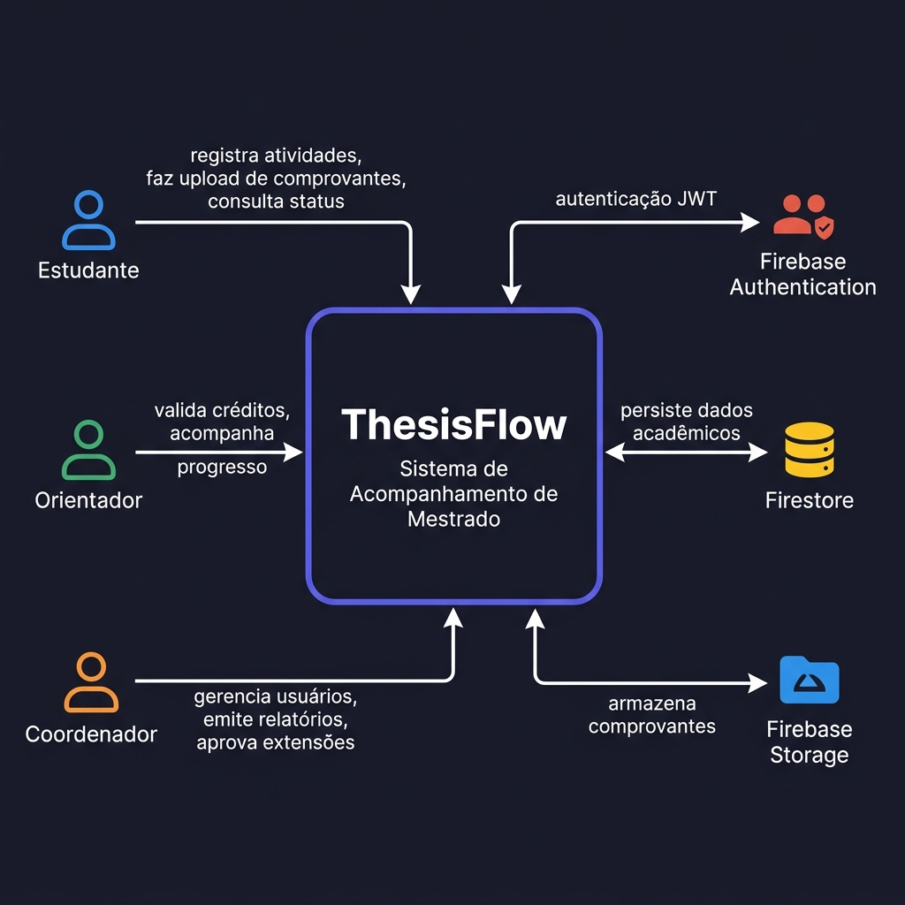
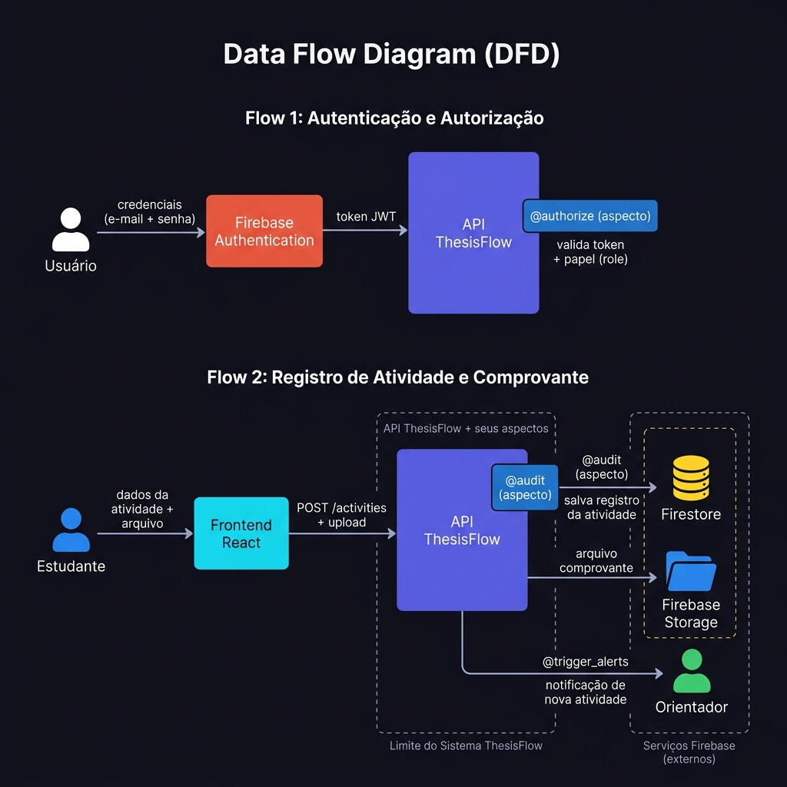
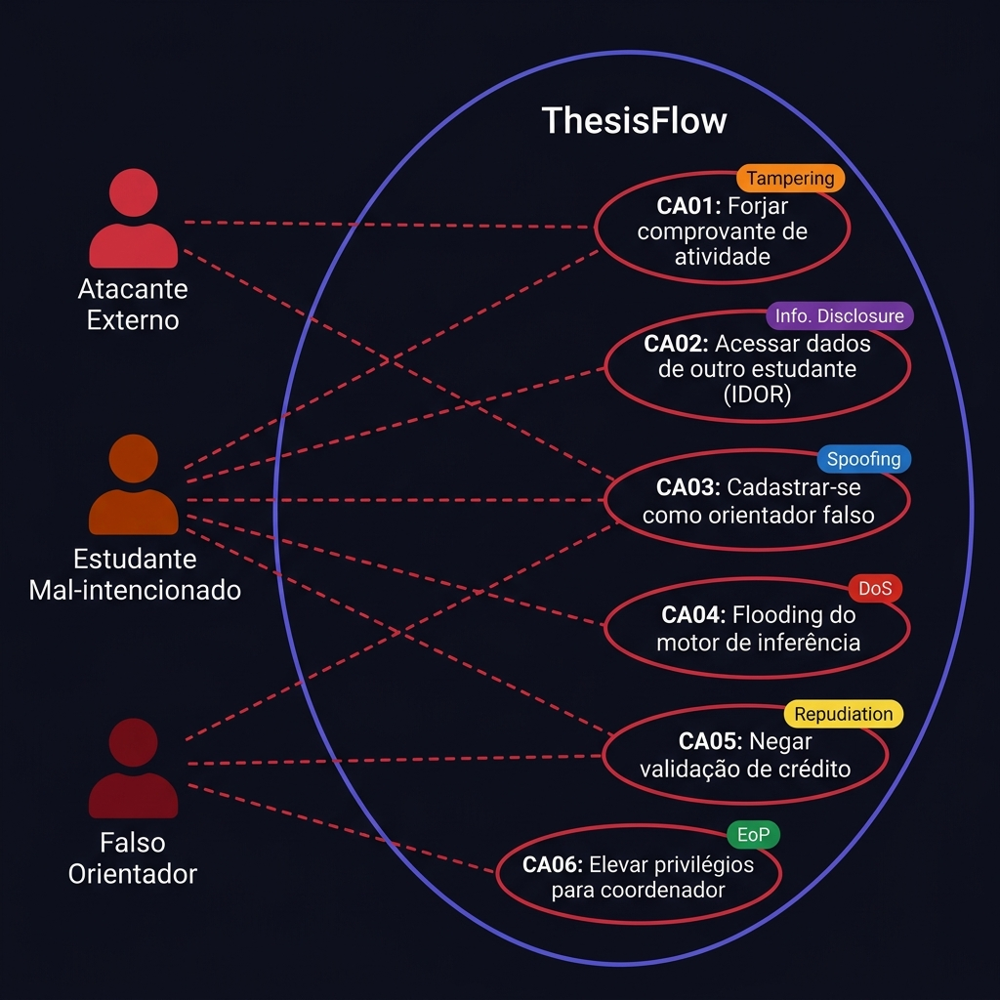

# ThesisFlow — Modelagem de Ameaças e Análise de Riscos de Segurança

**Grupo 06 — Engenharia de Software Seguro — UNIPAMPA**

> Este documento é o arquivo principal do trabalho. Cada seção está disponível também em arquivo individual na pasta [`docs/etapas/`](etapas/) para facilitar a colaboração e os commits individuais. O conteúdo completo e final está consolidado abaixo.

---

## Índice

### Etapa 1 — Casos de Abuso e Modelagem de Ameaças com STRIDE

| # | Seção | Arquivo de trabalho |
|---|-------|-------------------|
| 1 | [Identificação e descrição do sistema](#1-identificação-do-sistema) | [etapa-1-sec1-identificacao-descricao.md](etapas/etapa-1-sec1-identificacao-descricao.md) |
| 2 | [Usuários, ativos e pontos de interação](#3-usuários-ativos-e-pontos-de-interação) | [etapa-1-sec2-usuarios-ativos.md](etapas/etapa-1-sec2-usuarios-ativos.md) |
| 3 | [Visão geral da arquitetura](#4-visão-geral-da-arquitetura) | [etapa-1-sec3-arquitetura.md](etapas/etapa-1-sec3-arquitetura.md) |
| 4 | [Modelagem de ameaças com STRIDE](#5-modelagem-de-ameaças-com-stride) | [etapa-1-sec4-stride.md](etapas/etapa-1-sec4-stride.md) |
| 5 | [Casos de abuso](#6-casos-de-abuso) | [etapa-1-sec5-casos-de-abuso.md](etapas/etapa-1-sec5-casos-de-abuso.md) |
| 6 | [Considerações finais](#7-considerações-finais) | [etapa-1-sec6-consideracoes.md](etapas/etapa-1-sec6-consideracoes.md) |

### Etapa 2 — Análise, Priorização e Tratamento de Riscos com o NIST CSF

> 🔜 A Etapa 2 será adicionada a este documento após a disponibilização do material de referência pelo professor.

---
---

## Etapa 1 — Casos de Abuso e Modelagem de Ameaças com STRIDE

---

## 1. Identificação do sistema

- **Nome do sistema:** ThesisFlow — Sistema de Acompanhamento de Mestrado
- **Integrantes do grupo:**
  - Artur Wahlbrink Kraemer
  - Marcus Vinicius Morini Querol Junior
  - Bernardo Gomes Dorneles
  - Gustavo Fernandes dos Anjos
  - Fade Hassan Husein Kanaan
  - Rodrigo Thoma da Silva
- **Repositório:** [https://github.com/fadekanaan/es-seguro-gp06](https://github.com/fadekanaan/es-seguro-gp06)
- **Justificativa:** O ThesisFlow foi escolhido por ser um sistema real desenvolvido pelo próprio grupo durante a disciplina de Engenharia de Software no mesmo semestre. Isso nos permite realizar uma análise contextualizada e aprofundada, pois conhecemos em detalhes sua arquitetura, seus componentes, os dados que armazena e como os usuários interagem com ele. O sistema reúne múltiplos perfis de usuário, armazena dados pessoais e acadêmicos sensíveis, realiza autenticação, controla permissões e integra serviços externos — tornando-o um objeto de estudo rico para a análise de segurança com STRIDE e NIST CSF.

---

## 2. Descrição do sistema

O **ThesisFlow** é um sistema de acompanhamento acadêmico voltado a programas de mestrado com duração de 24 meses. Seu objetivo é auxiliar estudantes, orientadores e coordenadores no acompanhamento do progresso acadêmico ao longo de todo o curso, cobrindo plano de trabalho, tarefas, atividades creditáveis, validação de créditos, prazos, status acadêmico e requisitos para a defesa de dissertação.

### Problema que o sistema resolve

Programas de pós-graduação exigem que os estudantes cumpram uma série de requisitos ao longo dos meses: completar um número mínimo de créditos, registrar atividades acadêmicas com comprovação, cumprir marcos do plano de trabalho e submeter produções científicas. Sem um sistema centralizado, esse acompanhamento é fragmentado, dependente de planilhas, e-mails e processos manuais sujeitos a erros. O ThesisFlow centraliza esse processo em uma plataforma web segura e auditável.

### Quem utiliza o sistema

| Perfil | Descrição |
|--------|-----------|
| **Estudante** | Matriculado no programa de mestrado. Registra atividades, faz upload de comprovantes, acompanha seu plano de trabalho e consulta seu status acadêmico. |
| **Orientador** | Professor responsável por um ou mais estudantes. Valida atividades creditáveis, acompanha o progresso do orientando e registra produções científicas. |
| **Coordenador** | Responsável pela administração do programa. Gerencia cadastros de usuários, define tipos de atividades creditáveis, aprova extensões de prazo, emite relatórios gerenciais e configura políticas acadêmicas. |

### Principais funcionalidades

- Cadastro e gerenciamento de estudantes, orientadores e coordenadores
- Registro e acompanhamento do plano de trabalho e suas etapas
- Registro de atividades creditáveis com upload de comprovantes (artigos, certificados, diplomas)
- Validação de créditos por orientadores
- Inferência automática do status acadêmico via motor lógico interno
- Geração de alertas automáticos sobre prazos e pendências
- Emissão de relatórios gerenciais para coordenadores
- Registro de produções científicas com classificação por tipo e período

### Informações armazenadas e transmitidas

- Dados pessoais dos estudantes (nome, e-mail, matrícula)
- Credenciais de acesso (gerenciadas pelo Firebase Authentication)
- Planos de trabalho com datas, etapas e prazos
- Registros de atividades creditáveis com comprovantes em arquivo (Firebase Storage)
- Produções científicas com metadados de autoria e venue
- Histórico de validações e aprovações
- Logs de auditoria de todas as operações sensíveis
- Status acadêmico inferido (regular, em risco, apto para defesa, etc.)
- Relatórios gerenciais com dados agregados de todo o programa

### Recursos que precisam ser protegidos

- Credenciais de autenticação
- Dados pessoais dos estudantes
- Comprovantes e documentos (arquivos no Firebase Storage)
- Registros de validação e aprovação de créditos
- Logs de auditoria
- Status acadêmico de cada estudante
- Planos de trabalho e prazos
- Permissões e papéis de acesso (RBAC)

---

## 3. Usuários, ativos e pontos de interação

### 3.1 Usuários e perfis de acesso

| Usuário | Papel no sistema | Principais ações |
|---------|-----------------|-----------------|
| **Estudante** | `student` | Registrar atividades, fazer upload de comprovantes, consultar plano de trabalho, acompanhar status acadêmico |
| **Orientador** | `advisor` | Validar atividades creditáveis, acompanhar progresso do orientando, registrar produções científicas |
| **Coordenador** | `coordinator` | Gerenciar usuários e papéis, definir tipos de atividades, aprovar extensões de prazo, emitir relatórios |
| **Administrador de sistema** | acesso via bootstrap | Criar a conta inicial de coordenador via script privilegiado (`bootstrap_admin.py`) |

### 3.2 Dados pessoais e sensíveis

| Dado | Quem tem acesso | Por quê é sensível |
|------|----------------|-------------------|
| Nome, e-mail e matrícula do estudante | Orientador, Coordenador, o próprio estudante | Dados pessoais protegidos pela LGPD |
| Credenciais de acesso (token JWT) | Usuário e Firebase Auth | Permitem acesso total à conta se comprometidos |
| Comprovantes de atividade (arquivos) | Estudante (upload), Orientador (validação) | Podem conter diplomas, certidões, artigos não publicados |
| Produções científicas e publicações | Orientador, Coordenador | Podem incluir trabalhos ainda não publicados |
| Status acadêmico inferido | Coordenador, Orientador, Estudante | Revela situação de risco ou atraso |
| Histórico de aprovações e validações | Coordenador, Orientador | Permite rastrear responsabilidades |
| Logs de auditoria | Coordenador, Administrador | Registros de todas as operações sensíveis |

### 3.3 Ativos importantes

Os ativos listados abaixo podem causar prejuízo significativo caso sejam acessados, alterados, destruídos ou indisponibilizados de forma indevida:

1. **Credenciais e tokens de autenticação** — comprometê-los permite assumir a identidade de qualquer usuário
2. **Dados pessoais dos estudantes** — exposição viola privacidade e pode acarretar consequências legais (LGPD)
3. **Comprovantes de atividades creditáveis** — falsificação pode levar à validação indevida de créditos
4. **Registros de validação e aprovação** — alteração pode modificar o progresso acadêmico de um estudante
5. **Planos de trabalho e prazos** — adulteração pode mascarar atrasos ou criar inconsistências
6. **Logs de auditoria** — sem eles, não é possível responsabilizar autores de operações incorretas
7. **Status acadêmico inferido** — alteração pode permitir que estudantes inelegíveis avancem para a defesa
8. **Permissões e papéis (RBAC)** — elevação indevida de privilégios compromete toda a segurança

### 3.4 Pontos de interação e componentes

| Componente | Função | Tecnologia |
|-----------|--------|-----------|
| **Frontend React** | Interface web utilizada pelos usuários | React 18 + TypeScript + Vite |
| **API REST (backend)** | Processa todas as regras de negócio e operações | FastAPI (Python 3.11+) |
| **Firebase Authentication** | Valida identidade e emite tokens JWT | Firebase Auth (Google) |
| **Firestore** | Armazena todos os dados estruturados do sistema | Firebase Firestore (NoSQL) |
| **Firebase Storage** | Armazena os arquivos comprovantes das atividades | Firebase Storage (Google) |
| **Motor de inferência lógica** | Infere status acadêmico via cláusulas Horn | Implementação própria em Python |
| **Aspecto `@authorize`** | Controla acesso baseado em papel (RBAC) | Decorator Python (before advice) |
| **Aspecto `@audit`** | Registra todas as operações sensíveis | Decorator Python + `inspect` (after advice) |
| **Aspecto `@trigger_alerts`** | Envia notificações automáticas | Decorator Python (after advice) |

---

## 4. Visão geral da arquitetura

O ThesisFlow segue uma arquitetura em camadas estrita: **Router → Service → Repository → Infrastructure**. O frontend React se comunica com o backend FastAPI via HTTP REST. A autenticação é delegada ao Firebase Authentication, que emite tokens JWT verificados pela API a cada requisição. Os dados persistidos ficam no Firestore. Arquivos de comprovantes são armazenados no Firebase Storage.

A segurança da API é reforçada pelo aspecto `@authorize`, que valida o papel do usuário autenticado antes de qualquer operação sensível. O aspecto `@audit` registra automaticamente todas as operações de criação e alteração de dados.

### Diagrama de Contexto



### Diagrama de Fluxo de Dados

O diagrama abaixo ilustra dois fluxos críticos para a segurança: a autenticação/autorização e o registro de atividade com upload de comprovante.



### Visão simplificada da arquitetura

```
Usuário (browser)
       │
       ▼
Frontend React
       │ HTTP + Bearer token JWT
       ▼
API FastAPI ──────────────────────────────────────────────────┐
  │ @authorize → verifica role (RBAC)                         │
  │ @audit     → registra operação                            │
  │ @trigger_alerts → notifica partes interessadas            │
  │                                                           │
  ├─▶ Service Layer (regras de negócio)                       │
  │       └─▶ resolver.query() → Motor Lógico (inferência)   │
  │       └─▶ Repository → Firestore (dados estruturados)     │
  │       └─▶ Firebase Storage (comprovantes)                 │
  │                                                           │
  └─▶ Firebase Authentication (validação de token JWT) ───────┘
```

---

## 5. Modelagem de ameaças com STRIDE

A análise STRIDE foi aplicada aos componentes e ativos do ThesisFlow. Para cada categoria, foram identificadas ameaças concretas e relacionadas ao funcionamento do sistema.

| ID | Categoria STRIDE | Componente ou ativo | Ameaça identificada | Possível impacto |
|----|-----------------|--------------------|--------------------|-----------------|
| T01 | Spoofing | Firebase Auth / Token JWT | Um atacante rouba ou captura o token JWT de um usuário autenticado (via XSS, interceptação ou vazamento) e passa a utilizá-lo para autenticar requisições como se fosse a vítima | Acesso completo à conta: leitura de dados, upload de arquivos, validação de atividades em nome de outro usuário |
| T02 | Spoofing | Cadastro de orientador | Um usuário se cadastra como orientador informando dados falsos de vínculo institucional, pois o sistema não valida o vínculo real com a universidade | Acesso a dados privados de estudantes, possibilidade de validar créditos indevidamente como se fosse um professor legítimo |
| T03 | Tampering | Comprovantes no Firebase Storage | Um estudante substitui o arquivo de comprovante legítimo por um documento forjado após o upload, explorando a URL de acesso ao Storage sem restrição de imutabilidade | Validação de atividade creditável com documento falso, obtendo créditos indevidos |
| T04 | Tampering | Plano de trabalho e prazos | Um usuário com acesso indevido à API altera datas de prazo ou marcos do plano de trabalho de um estudante, modificando o registro sem autorização | Mascaramento de atrasos acadêmicos, geração de inconsistências no histórico e dificuldade de auditoria posterior |
| T05 | Repudiation | Logs de auditoria (`@audit`) | O aspecto de auditoria é desabilitado em tempo de execução (via flag `ASPECTS_ENABLED`) ou os logs são apagados/alterados; um orientador nega ter aprovado determinada atividade | Impossibilidade de responsabilizar o autor de uma operação, dificultando investigação de fraudes acadêmicas |
| T06 | Repudiation | Operações de coordenador | Um coordenador realiza uma operação administrativa (ex.: aprovação de extensão de prazo) e, na ausência de log imutável com identificação completa, nega posteriormente ter realizado a ação | Contestações sem evidências, comprometimento da responsabilização institucional |
| T07 | Information Disclosure | API REST / Firestore | Um estudante autenticado modifica o identificador de outro estudante em uma requisição GET (ataque IDOR — Insecure Direct Object Reference), e a API retorna dados do outro estudante sem verificar a propriedade do recurso | Exposição de dados pessoais, plano de trabalho, status acadêmico e produção científica de terceiros |
| T08 | Information Disclosure | Firebase Storage | A URL de download de um comprovante armazenado no Firebase Storage não exige autenticação para ser acessada; a URL é compartilhada ou descoberta por terceiros | Exposição de documentos pessoais sensíveis (diplomas, certidões, artigos não publicados) |
| T09 | Denial of Service | API FastAPI / Motor lógico | Um atacante envia um grande volume de requisições a endpoints que invocam o motor de inferência lógica, que realiza operações computacionalmente intensas sem limitação de taxa | Degradação ou indisponibilidade do sistema durante períodos críticos (ex.: período de qualificações e defesas) |
| T10 | Denial of Service | Firebase Storage | Um usuário autenticado realiza upload massivo de arquivos de grande volume, esgotando a cota de armazenamento do plano Firebase utilizado pelo sistema | Bloqueio de uploads legítimos de outros estudantes, impossibilitando o envio de comprovantes |
| T11 | Elevation of Privilege | Aspecto `@authorize` (RBAC) | Um estudante autenticado manipula uma requisição HTTP para chamar diretamente um endpoint restrito a coordenadores (ex.: `POST /activity-types`), explorando falha na verificação de papel ou ausência do decorator | Acesso a funções administrativas: criação de tipos de atividades, aprovação de extensões, acesso a relatórios gerenciais |
| T12 | Elevation of Privilege | Script `bootstrap_admin.py` | O script de criação da conta inicial de coordenador fica acessível ou executável remotamente em ambiente de produção (ex.: via endpoint não autenticado, variável de ambiente exposta ou acesso indevido ao servidor) | Criação de uma conta de coordenador com privilégios máximos por um atacante externo, comprometendo toda a segurança do sistema |

### 5.1 Interpretação da análise

As doze ameaças identificadas abrangem todas as seis categorias do STRIDE no contexto específico do ThesisFlow. As ameaças de **Spoofing** comprometem a identidade dos usuários e a confiança nas ações realizadas. O **Tampering** afeta a integridade dos dados acadêmicos e dos comprovantes, que são a base para decisões importantes de validação. A **Repudiation** prejudica a capacidade de auditoria e responsabilização — especialmente crítica em um contexto acadêmico formal. A **Information Disclosure** expõe dados pessoais protegidos pela LGPD. O **Denial of Service** pode impedir o uso do sistema em momentos críticos do calendário acadêmico. Por fim, a **Elevation of Privilege** pode comprometer toda a estrutura de controle de acesso do sistema.

---

## 6. Casos de abuso

### Diagrama de Casos de Abuso



---

### CA01 — Forja de comprovante para validação indevida de créditos

**Identificador:** CA01

**Ator malicioso:** Estudante mal-intencionado.

**Objetivo do abuso:** Obter validação de créditos por meio de um comprovante falso ou de um documento legítimo de outra pessoa.

**Condições necessárias:**
- O sistema aceita upload de arquivos sem verificar o conteúdo ou autenticidade do documento.
- A URL de acesso ao arquivo no Firebase Storage não possui controle de imutabilidade após o upload.
- O orientador não possui mecanismo de verificação adicional além da visualização do arquivo.

**Sequência de ações:**
1. O estudante registra uma atividade creditável no sistema com dados corretos (tipo, descrição, data).
2. O estudante faz upload de um comprovante que pode ser falso (documento adulterado) ou de terceiro (comprovante roubado ou copiado).
3. O sistema aceita o arquivo e associa a URL ao registro da atividade.
4. O orientador recebe notificação e visualiza o arquivo — que aparenta ser legítimo.
5. O orientador valida a atividade sem perceber a fraude.
6. O sistema registra os créditos como válidos na conta do estudante.

**Impacto esperado:** O estudante obtém créditos acadêmicos sem ter realizado a atividade correspondente, o que compromete a integridade do programa e pode permitir que ele avance para a defesa sem cumprir os requisitos reais.

**Categorias STRIDE relacionadas:** Tampering, Repudiation.

---

### CA02 — Acesso indevido a dados de outro estudante via IDOR

**Identificador:** CA02

**Ator malicioso:** Estudante autenticado no sistema.

**Objetivo do abuso:** Acessar informações privadas de outros estudantes — plano de trabalho, status acadêmico, produções registradas — sem autorização.

**Condições necessárias:**
- A API não verifica se o recurso solicitado pertence ao usuário autenticado.
- Os identificadores de recursos (IDs de estudante, IDs de atividade) são sequenciais ou previsíveis.
- A resposta da API retorna o objeto completo sem filtragem por proprietário.

**Sequência de ações:**
1. O estudante autentica-se normalmente com suas próprias credenciais.
2. O estudante acessa um recurso próprio e observa o identificador na URL (ex.: `GET /students/{student_id}/activities`).
3. O estudante modifica o identificador na requisição (ex.: incrementa o valor ou testa outros IDs).
4. A API processa a requisição sem verificar se o `student_id` pertence ao usuário autenticado.
5. O sistema retorna os dados do estudante correspondente ao ID modificado.
6. O estudante repete a operação sistematicamente, coletando dados de múltiplos estudantes.

**Impacto esperado:** Exposição de dados pessoais e acadêmicos de terceiros, violação de privacidade com implicações legais (LGPD), e possível uso das informações para fraudes ou pressão sobre outros estudantes.

**Categorias STRIDE relacionadas:** Information Disclosure.

---

### CA03 — Cadastro de falso orientador para obter acesso a dados de estudantes

**Identificador:** CA03

**Ator malicioso:** Atacante externo que deseja se passar por orientador.

**Objetivo do abuso:** Obter o papel de orientador no sistema para acessar dados privados de estudantes e potencialmente validar atividades ou influenciar o progresso acadêmico de outros usuários.

**Condições necessárias:**
- O sistema permite cadastro de orientadores sem validar o vínculo real com a instituição.
- O processo de criação de conta de orientador não exige confirmação por parte de um coordenador.
- O atacante consegue criar um e-mail com domínio institucional ou similar.

**Sequência de ações:**
1. O atacante cria uma conta no Firebase Authentication com um e-mail plausível.
2. O atacante registra-se no sistema como orientador, informando dados falsos de nome e vínculo.
3. O sistema aceita o cadastro sem verificação adicional.
4. O atacante é associado a um ou mais estudantes como orientador.
5. O atacante passa a ter acesso aos dados pessoais, plano de trabalho e comprovantes dos estudantes orientados.
6. O atacante pode validar atividades indevidamente ou coletar dados para outros fins.

**Impacto esperado:** Exposição de dados pessoais de estudantes, comprometimento da confidencialidade de documentos acadêmicos, validações fraudulentas e perda de confiança no sistema.

**Categorias STRIDE relacionadas:** Spoofing, Information Disclosure, Elevation of Privilege.

---

### CA04 — Ataque de flooding ao motor de inferência durante período crítico

**Identificador:** CA04

**Ator malicioso:** Atacante externo com acesso autenticado ou com credenciais comprometidas.

**Objetivo do abuso:** Tornar o sistema indisponível durante um período crítico do calendário acadêmico (ex.: período de qualificações, defesas ou entrega de relatórios semestrais).

**Condições necessárias:**
- O sistema não possui limitação de taxa de requisições (rate limiting) nos endpoints da API.
- O motor de inferência lógica realiza operações computacionalmente intensas a cada invocação.
- Não há mecanismo de cache para resultados já calculados recentemente.

**Sequência de ações:**
1. O atacante autentica-se no sistema com credenciais próprias ou roubadas.
2. O atacante identifica os endpoints que invocam o motor lógico (ex.: `GET /students/{id}/status`).
3. O atacante envia requisições em alta frequência para esses endpoints via script.
4. O motor de inferência é invocado repetidamente, consumindo CPU e memória do servidor.
5. O sistema começa a responder com lentidão ou erros para todos os usuários.
6. Estudantes e orientadores não conseguem acessar o sistema durante o período crítico.

**Impacto esperado:** Indisponibilidade do sistema, perda de prazos acadêmicos por parte de estudantes legítimos, aumento de carga administrativa e possível prejuízo ao calendário do programa.

**Categorias STRIDE relacionadas:** Denial of Service.

---

### CA05 — Orientador nega ter aprovado validação de crédito

**Identificador:** CA05

**Ator malicioso:** Orientador desonesto ou com interesses conflitantes.

**Objetivo do abuso:** Negar a responsabilidade por uma validação de crédito já realizada, seja para prejudicar o estudante, encobrir um erro próprio ou evitar consequências de uma aprovação indevida.

**Condições necessárias:**
- O aspecto `@audit` pode ser desabilitado via flag de configuração (`ASPECTS_ENABLED["audit"] = False`).
- Os logs de auditoria não são imutáveis ou podem ser alterados por quem tem acesso ao banco de dados.
- Não há assinatura digital ou mecanismo criptográfico que vincule a validação ao orientador.

**Sequência de ações:**
1. O orientador valida a atividade de um estudante no sistema.
2. O sistema registra a operação via `@audit`, associando-a ao token JWT do orientador.
3. Posteriormente, o orientador afirma não ter realizado a validação.
4. Se os logs forem incompletos, alteráveis ou sem identificação suficiente, não há prova da ação.
5. A contestação não pode ser resolvida, e o estudante pode ter seus créditos cancelados.

**Impacto esperado:** Prejuízo acadêmico direto ao estudante, impossibilidade de responsabilização do orientador e necessidade de processos administrativos para resolução da disputa.

**Categorias STRIDE relacionadas:** Repudiation.

---

### CA06 — Estudante eleva seus próprios privilégios para coordenador

**Identificador:** CA06

**Ator malicioso:** Estudante com conhecimento técnico sobre APIs REST.

**Objetivo do abuso:** Contornar o controle de acesso baseado em papel (RBAC) para acessar funcionalidades restritas a coordenadores.

**Condições necessárias:**
- Existe um endpoint administrativo sem o decorator `@authorize(role="coordinator")` ou com verificação insuficiente.
- O estudante consegue descobrir a URL de um endpoint restrito (via documentação Swagger em `/docs`, erros expostos ou análise de tráfego).
- O sistema não verifica consistência de papel no servidor além do token JWT.

**Sequência de ações:**
1. O estudante autentica-se normalmente.
2. O estudante explora a API buscando endpoints não protegidos (ex.: usando a documentação Swagger).
3. O estudante identifica o endpoint `POST /activity-types` ou similar.
4. O estudante envia uma requisição com seu token JWT de estudante para o endpoint restrito.
5. Se a verificação for ausente ou falha, o sistema processa a requisição.
6. O estudante cria ou altera configurações do sistema, afetando outros usuários.

**Impacto esperado:** Alteração de configurações do programa, criação de tipos de atividades falsas e comprometimento da integridade do sistema.

**Categorias STRIDE relacionadas:** Elevation of Privilege, Tampering.

---

## 7. Considerações finais

### Ameaças mais preocupantes

As ameaças consideradas mais críticas são a exposição de dados por IDOR (T07), o roubo de token JWT (T01) e a falsificação de comprovantes (T03). Essas ameaças afetam diretamente a integridade e a confidencialidade do sistema, podendo comprometer a validade do processo acadêmico.

A ameaça T07 (IDOR) é particularmente preocupante porque exige pouco conhecimento técnico — qualquer estudante autenticado pode tentar modificar identificadores em requisições — e seu impacto é elevado, pois viola a privacidade de múltiplos usuários e pode gerar consequências legais conforme a LGPD.

A ameaça T01 (roubo de token JWT) é crítica pela abrangência: um token de coordenador comprometido expõe todo o sistema administrativo, enquanto um token de orientador compromete os dados de todos os seus orientandos.

### Ativos mais importantes

Os ativos mais valiosos são as **credenciais de autenticação** (token JWT), os **comprovantes de atividades** (arquivos no Firebase Storage), os **registros de validação** e os **logs de auditoria**. Esses elementos são a base para todas as decisões acadêmicas tomadas pelo sistema — a integridade do diploma emitido ao final do programa depende diretamente da confiabilidade dessas informações.

### Tipos de abuso com maior impacto

- **CA03 (falso orientador):** permite acesso prolongado e sistemático a dados de múltiplos estudantes, com grande dificuldade de detecção.
- **CA01 (forja de comprovante):** compromete a validade acadêmica dos créditos validados, podendo levar um estudante a defender uma dissertação sem ter cumprido os requisitos reais.
- **CA06 (elevação de privilégios):** compromete toda a estrutura de controle de acesso do sistema, permitindo alterações que afetam todos os usuários.

### Principais dificuldades encontradas

A maior dificuldade foi diferenciar ameaças genéricas de situações concretas e específicas ao ThesisFlow. O conhecimento profundo do sistema, por ter sido desenvolvido pelo grupo, facilitou a identificação de pontos realmente vulneráveis — como o flag `ASPECTS_ENABLED` que pode desabilitar a auditoria, ou a ausência de restrição de imutabilidade nos arquivos do Storage.

Outra dificuldade foi determinar o limite entre **ameaça** (o que pode acontecer), **vulnerabilidade** (a condição que permite) e **ataque** (a ação do agente malicioso). A utilização do STRIDE ajudou a estruturar essa análise por perspectivas distintas, revelando ameaças que poderiam não ser percebidas em uma análise apenas funcional.

Por fim, a categoria **Repudiation** foi a mais difícil de contextualizar, pois depende não apenas de uma falha técnica, mas também do comportamento dos usuários e da qualidade dos registros de auditoria — que no ThesisFlow podem ser desabilitados via configuração.
